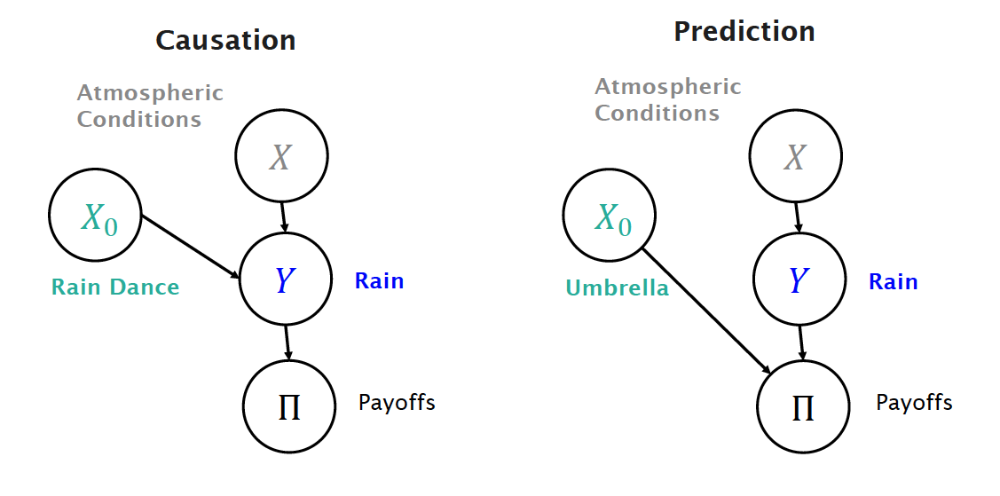
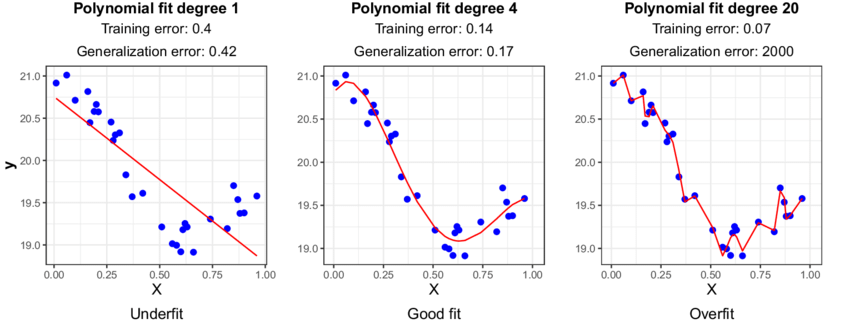
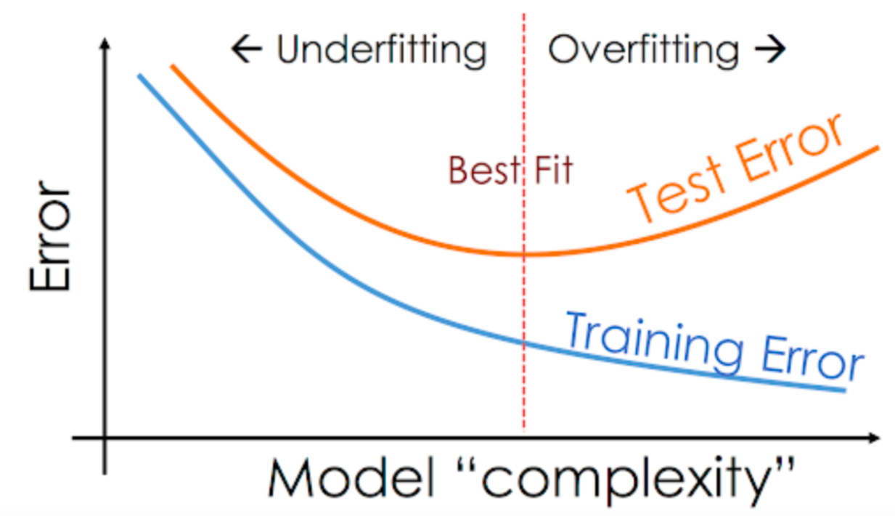

layout: true
background-image: url(images/ucab.png)
background-position: 100% 0%
background-size: 5%
---
class: inverse, center, middle

# Causalidad - Clase 10

## José Morales-Arilla y Carlos Daboín

#### Universidad Católica Andrés Bello 
#### Junio, 2022

```{r setup, echo = FALSE}
knitr::opts_chunk$set(fig.retina = 3, fig.width = 6, fig.asp = 0.618, out.width = "70%", fig.align = "center", warning = FALSE, message = FALSE)
library(tidyverse)
library(fixest)
library(haven)
library(stats)
library(dagitty)
library(lavaan)
```

---
# ¿Qué aprendimos la clase pasada? 

### Casos de estudio comparativo: Solo un individuo fue tratado.

### Cambios en el individuo después del tratamiento pueden deberse a tendencias.

### El promedio simple de los otros puede no ser representativo del individuo tratado pre-tratamiento.

### Control sintético: 
- Promedio ponderado de otros individuos que mejor representa al individuo tratado antes del tratamiento. 
- Control sintético y unidad tratada deben moverse muy cerca hasta el tratamiento. Diferencias posteriores = Efecto

### Tests para evaluar validez del control sintético:
- Tratamiento placebo: Replicar ejercicio poniendo el momento del tratamiento en un período previo.
- Ubicación placebo: Replicar para otros individuos y mostrar que el efecto/pérdida de predictibilidad son únicas.

---
# De causalidad a predicción

### Hasta ahora hemos ido modelando regresiones lineales:

$$Y_i = \beta_0 + \sum_{k=1}^K \beta_k X^k_i + \epsilon_i\text{, donde } \beta_k\text{'s minimizan } \sum_{i=1}^N\epsilon_i^2=\sum_{i=1}^N(Y_i-\hat{Y_i})^2$$

### Nuestra preocupación ha sido fundamentalmente sobre la consistencia de un estimador.
- Queremos saber cual es el efecto de una de las $X$ sobre $Y$. Queremos que esa estimación no sea sesgada.
- ¿Qué significa que un estimador sea insesgado (o "consistente")? 
    - El coeficiente que te da la regresión (el estimado, o $\hat{\beta_k}$) va a depender de la muestra de datos.
  - Pero si el estimador es insesgado, el valor esperado de correr la regresión es el parámetro ( $E[\beta_k-\hat{\beta_k}]=0$ )

### Si nos ha interesado el coeficiente de una sola variable, ¿Por qué controlamos por otras cosas?
- Cerrar puertas traseras que inducen sesgos de selección/variables omitidas. (¿Cuáles eran los malos controles?)

---
# De causalidad a predicción

### A veces corremos modelos estadísticos porque nos interesan las predicciones $\hat{Y_i}$.
- Es decir, nos interesa un modelo que minimice $\sum_{i=1}^N(Y_i-\hat{Y_i})^2$ (o alguna medida proporcional, como el $R^2$).

### Suponte que tienes dos modelos econométricos de la criminalidad en ciudades venezolanas.
#### - Supuesto: Cuentas con variación exógena en el número de policías.

### Modelo 1: $C_i = \beta_0 + \beta_1*Poli_i+\epsilon_i$  ( $R^2=0.05$ )
### Modelo 2: $C_i = \beta_0 + \beta_1*Poli_i+\beta_2*Arrestos_i+\epsilon_i$  ( $R^2=0.25$ )

### ¿Cuál modelo es mejor?

---
# De causalidad a predicción

### A veces corremos modelos estadísticos porque nos interesan las predicciones $\hat{Y_i}$.
- Es decir, nos interesa un modelo que minimice $\sum_{i=1}^N(Y_i-\hat{Y_i})^2$ (o alguna medida proporcional, como el $R^2$).

### Suponte que tienes dos modelos econométricos de la criminalidad en ciudades venezolanas.
#### - Supuesto: Cuentas con variación exógena en el número de policías.

### Modelo 1: $C_i = \beta_0 + \beta_1*Poli_i+\epsilon_i$  ( $R^2=0.05$ )
### Modelo 2: $C_i = \beta_0 + \beta_1*Poli_i+\beta_2*Arrestos_i+\epsilon_i$  ( $R^2=0.25$ )

### ¿Cuál modelo es mejor? Depende: (1) para causalidad, (2) para predicción.
---
# Causalidad es predicción bajo manipulación. Predicción no.
.center[

]


---
# Preguntas de predicción

### Están en todos lados: Netflix, Amazon, Spotify se la pasan recomendándote cosas...

- Suponte que eres Netflix y estás estrenando Stranger Things. Quieres recomendársela a quien pueda gustarle. 
- Hiciste un piloto con una muestra aleatoria de 1000 usuarios que pudieron ver la serie antes de estrenarla.
- Los usuarios te dieron un puntaje del 1 al 100 sobre que tanto les gustó. Para los demás, no sabes si les gustará.
- ¿Qué puedes hacer para identificar a quien puede que le guste Stranger Things cuando nunca la han visto?

--

### Econometría al rescate: Cada usuario es una observación del grupo piloto es una observación $i$. 
- $Y_i$: Puntaje de Stranger Things (1-100). $X^k$: Si la persona había visto la serie $k$ previa a Stranger Things (0-1). 
- Correr regresión $Y_i=\beta_0+\sum_{k=1}^K\beta_k*X^k_i+\epsilon_i$, la cual minimiza $\sum_{i_1}^N(Y_i-\hat{Y_i})^2$.
- Tomar los $\beta_k$ calculados sobre el grupo piloto y aplicárselos a los individuos $j$ que no son parte del grupo piloto.

--

### Resultado: Tienes una predicción $\hat{Y_j}$ para todos los individuos fuera de la prueba piloto.

---
# Preguntas de predicción

### Los economistas encontramos preguntas de predicción todo el tiempo.
- Suponte que eres un economista en el Ministerio de Educación y te preocupa la malnutrición infantil.
- Quieres ofrecerle a los profesores una herramienta que les de la probabilidad de que un niño esté malnutrido.
- Esto tiene que basarse en medidas antropométricas/sociodemográficas que el mismo maestro pueda tomar.
- Organizas a un grupo de doctores para diagnosticar malnutrición en una muestra aleatoria de 10000 niños.
- A estos niños les tomas las mismas variables antropométricas/sociodemográfica disponibles a los maestros.

--

### Econometría al rescate: Cada observación es un niño en la muestra aleatoria.
- $Y_i$: Nivel de desnutrición. $X^k_i$: Variable antropométrica/sociodemocráfica $k$.  
- Correr regresión $Y_i=\beta_0+\sum_{k=1}^K\beta_k*X^k_i+\epsilon_i$, la cual minimiza $\sum_{i_1}^N(Y_i-\hat{Y_i})^2$.
- Tomar los $\beta_k$ calculados sobre la muestra, que los maestros metan los datos de sus niños $j$ en un app.

### Resultado: Tienes una probabilidad de malnutrición $\hat{Y_j}$ para todos los niños del país.

---
# Y muchos casos más. Un área muy activa de la estadística.

### ¿Qué le va a pasar al precio del petróleo? ¿Qué tan sobre-valuada o sub-valuada está esta acción?

### ¿Cuál es el riesgo de prestarle plata alguien? ¿De que un reo liberado reincida en actividades criminales?

### ¿Quiénes son los votantes indecisos en esta elección? ¿Cuál es la probabilidad de una crisis política?

--

### Problemas éticos: No solo porque *puedes* hacer algo significa que *debes* hacerlo.

--

### En general: Conseguir correlaciones robustas en **una data** donde observas resultado y "predictores"...

--

### ...para poder hacer predicciones en **otra data** para la cual (aún) no se observan los resultados.

--

### Veamos un ejemplo: Predecir la movilidad social de las ciudades americanas.

---
# El problema del sobreajuste ("Overfitting")

### Los $\beta_k$ se calculan para minimizar $\sum_{i=1}^N\epsilon_i^2$ en la data de entrenamiento.

--

### La data de entrenamiento junta "señal" sobre relaciones entre las variables y ruido estadístico.

--

### La "señal" en la data de entrenamiento también está en la data de evaluación. El "ruido" es específico.

--

### Los modelos difieren entre si por su "complejidad". Complejidad en MCO: Número de variables.

--

### Modelos demasiado simples capturan poca señal en la data de entrenamiento (subajuste).

--

### Modelos demasiado complejos capturan mucho ruido en la data de entrenamiento (sobreajuste).

--

### Hay un nivel de complejidad óptimo que minimiza el error "fuera de la muestra" de entrenamiento.

---
# El problema del sobreajuste ("Overfitting")

.center[

]

---
# El problema del sobreajuste ("Overfitting")

.center[

]

---
class: center, middle

# Veámoslo en una simulación

---
# Selección del modelo

### Suponte que tienes 3 predictores posibles: $A$, $B$ y $C$. 
### Sin contar expansiones polinómicas o interacciones, ¿Cuántos modelos lineales podrías correr?

--

- 8: La constante sola, A, B, C, AB, AC, BC, ABC. 

--

### Si tienes 4 predictores, ¿Cuántos modelos lineales podrías correr? 

--

- 16: Constante, A, B, C, D, AB, AC, AD, BC, BD, CD, ABC, ABD, ACD, BCD, ABCD.

--

### El número de modelos posibles explota con un mayor número de posibles predictores. 

--

### No solo hay que conseguir la complejidad ideal. Hay que identificar las variables que capturan la mayor señal posible para un nivel de complejidad dado... OK, chévere: ¿Cómo se hace eso?

---
# Selección del modelo
### Los economistas seguíamos un método iterativo llamado "selección por pasos" (Stepwise selection).

- ### 1) De todos los modelos de una sola variable, ¿Cuál es el mejor? Mantén esa variable en el modelo.
- ### 2) De todos los modelos de dos variables que incluyen la primera, ¿Cuál es el mejor? Mantén las dos.
- ### 3) Repetir hasta llegar a un número máximo de variables. 
- ### 4) Seleccionar nivel de complejidad que minimiza error cuadrático en data de evaluación.
- ### 5) Si no estás usando data de evaluación, minimiza el criterio de información de Akaike. 

### Hay distintas versiones de este [protocolo](https://www.statology.org/stepwise-regression-r/) (de simple a complejo, de complejo a simple, bidireccional...)

---
# Hasta que llegaron los computines con su *Machine Learning*.

### El método de selección por pasos es obviamente muy computacionalmente costoso.
- Tienes que ejecutar demasiados modelos.

### Esto es porque forzamos un solo método (MCO), y lo estimamos para un montón de combinaciones.
- Selección del modelo ideal para cada nivel de complejidad, y luego comparar entre complejidades.
- ¿Cuántos modelos de dos variables hay si tenemos 10 predictores posibles? 9 + 8 + 7 + ... = 45!

### Los computines se pusieron a diseñar métodos para facilitar la selección de modelos.
- Idealmente, se gana eficiencia si se corre un solo modelo para cada nivel de complejidad.

### "Machine Learning" es una forma de decir "que la máquina aprenda el modelo ideal".

---
# Modelos lineales de Machine Learning: Ridge y LASSO.

### Cuando corremos un MCO, estamos calculando $\beta_k$s que minimizan $\sum_{i=1}^N\epsilon_i^2$.

### Ridge regression: Calcula los $\beta_k$s para minimizar $\sum_{i=1}^N\epsilon_i^2+\lambda*\sum_{k=1}^K\beta_k^2$.

### LASSO regression: Calcula los $\beta_k$s para minimizar $\sum_{i=1}^N\epsilon_i^2+\lambda*\sum_{k=1}^K|\beta_k|$.

--

### La idea es que en ambos ejercicios es penalizar coeficientes muy distintos de 0.

--

### Como te interesan tanto los coeficientes pequeños como una buena predicción...

--

### ...las primeras variables penalizadas son las que no te agregan mucha señal!

---
# Modelos lineales de Machine Learning: Ridge y LASSO.

### La diferencia fundamental entre Ridge y Lasso es el tipo de penalización a los coeficientes.
- Para que todos los coeficientes pesen lo mismo, los predictores se estandarizan antes de empezar.
- Ridge: Penalización cuadrática. LASSO: Penalización absoluta. 
- Ridge va a ir reduciendo varios coeficientes en paralelo. LASSO va a llevar coeficientes hasta 0 secuencialmente.

--

### ¿Qué tanto se va a penalizar el tamaño de los coeficientes vs. los errores cuadráticos? Depende de $\lambda$!
- $\lambda$ es conocido como un "parámetro de regularización" (Tuning parameter). 
- Estos parámetros controlan la complejidad del modelo. En este caso, un $\lambda$ más bajo complejiza el modelo.
- Por ejemplo, si $\lambda$ es 0, tanto Ridge como LASSO convergen al MCO. 
- Si $\lambda$ es $\infty$, Ridge y LASSO convergen a un modelo que solo tiene la constante. 

--

### Lo importante es que para un nivel de $\lambda$ (Complejidad) solo hay que correr estos métodos una vez.
- Distinto a la selección por pasos. Ridge y LASSO: Metemos todas las variables, y que el método decida.

---
# P: ¿Y cómo escogemos el $\lambda$? R: Validación Cruzada.

### Hasta ahora hemos partido la data en una sección de entrenamiento y en una sección de evaluación.
- Data de entrenamiento para estimar $\beta_k$s. Data de evaluación para medir calidad de predicción "fuera de muestra".
- Si queremos comparar un modelo MCO seleccionado por pasos, un modelo Ridge con un y un modelo LASSO...
- ...decidiremos con cual de los tres modelos quedarnos de acuerdo a cual predice mejor en la data de evaluación.

### Ridge y LASSO: Seleccionar un $\lambda$ que minimice el error fuera de muestra... en la data de entrenamiento.

### Método de validación cruzada (Cross-Validation) para modelos de Machine Learning:
1. Divide la data de entrenamiento aleatoriamente en $P$ pedazos (usualmente 5 o 10).
2. Deja un pedazo por fuera y calcula el modelo para todos los valores de $\lambda$ que vas a considerar. 
3. Calcula el RMSE fuera de muestra de cada $\lambda$ sobre el pedazo que excluiste. Guarda esos valores. 
4. Repite el ejercicio iterando $P$ veces con el pedazo que excluyes para validar.
5. Promedia los RMSE fuera de muestra para cada valor de $\lambda$. Selecciona el valor de $\lambda$ con menor error promedio.
6. Fija el modelo de ML sobre toda la data de entrenamiento con el valor de $\lambda$ seleccionado.

---
class: center, middle

# Ejercicio: Predecir el precio de las casas.

---
# Próxima clase:

# ¿Qué pasa cuando el resultado es binario o categórico? 
- ### De la regresión a la clasificación.

# Introducción de métodos de ML no lineales: 
- ### Árboles de decisión (Decision Trees)
- ### Bosques Aleatorios (Random Forests)


---
class: center, middle

# Gracias