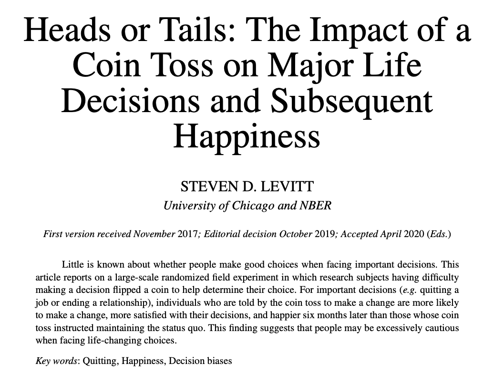
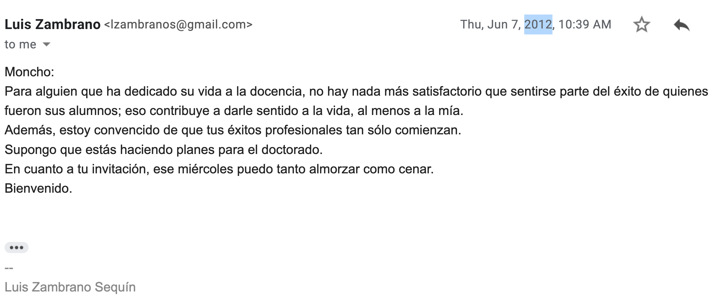

layout: true
background-image: url(images/ucab.png)
background-position: 100% 0%
background-size: 5%
---
class: inverse, center, middle

# Causalidad - Clase 15

## José Morales-Arilla y Carlos Daboín

#### Universidad Católica Andrés Bello 
#### Agosto, 2022

```{r setup, echo = FALSE}
knitr::opts_chunk$set(fig.retina = 3, fig.width = 6, fig.asp = 0.618, out.width = "70%", fig.align = "center", warning = FALSE, message = FALSE)
library(tidyverse)
library(fixest)
library(haven)
library(stats)
library(dagitty)
library(lavaan)
```

---
# ¿Qué aprendimos en esta clase? 

1. ### Problema fundamental de la inferencia causal: Los contrafactuales individuales no se ven.

--

2. ### Si la variación en $X$ es exógena: $X \sim Y = X \to Y$ para el individuo promedio.

--

3. ### Evidencia experimental: Crear tu propia data en la que garantizas que la variación de $X$ es exógena.

  - #### Validez interna garantizada, a veces a costa de la validez externa.

--

4. ### Evidencia cuasi-experimental: Analizar data que ya existe bajo "supuestos de identificación".
  
  - #### Pueden existir "puertas traseras" en la relación observada entre $X$ y $Y$.

--

5. ### Alternativa cuasi-experimental 1: Cerrar puertas traseras bajo el supuesto de un "modelo" (DAG).

  - ####  Sección cruzada: Controlar + Matching | Datos de panel: Efectos fijos.
  
---
# ¿Qué aprendimos en esta clase? 

5. ### Alternativa cuasi-experimental 2: Aislar variación exógena en la causa de interés.

--

6. ### Variables instrumentales: Deben ser "relevantes" y cumplir con la "restricción de exclusión".
  - #### $Z$ se relaciona con $X$, y solo puede asociarse con $Y$ a través de $X$. Instrumentos creíbles tienden a ser raros.

--

7. ### Regresión de discontinuidad: Lo único que brinca en el límite de la variable de asignación es $X$.
  - #### Si con el brinco de $X$ también hay un brinco de $Y$, es por el efecto causal de $X$ sobre $Y$. 

--

8. ### Diferencia en diferencias: $X$ no es exógeno, pero hay datos previos al tratamiento.
  - #### Tendencias paralelas: Evaluarlas antes del tratamiento, suponerlas después del tratamiento.
  - #### STP: Otros efectos del tiempo sobre $Y$ son independientes de $X$ (En promedio afectan a todos por igual).
  
---
# ¿Qué aprendimos en esta clase? 

9. ### Controles sintéticos: Construir un contrafactual que represente al caso de estudio pre-tratamiento.
  - #### Usualmente, solo un "individuo" es tratado. Individuos "donantes" nunca deben ser tratados. 
  - #### Efecto: Distancia post-tratamiento entre el individuo y su versión sintética ( $\approx 0$ para otros individuos).

--

10. ### Machine Learning: Robándole métodos a los computines cuando lo que nos interesa es predecir bien.
  - #### La predictibilidad que nos importa es *fuera de muestra*: sobre datos que el modelo no ha visto aún.
  - #### Complejidad de los modelos: Muy poca y no capturas señal. Demasiada y capturas puro ruido ("sobreajuste").
  - #### Validación cruzada para "entonar" modelos, comparar en data de evaluación para elegir modelos.
  - #### Modelos ML lineales: Lasso, Ridge | Modelos ML no-lineales: Árboles de decisión, bosques aleatorios.
  - #### Problemas de regresión ( $Y$ es continua) vs. Problemas de clasificación ( $Y$ es discreta, usualmente binaria).

---
# ¿Qué aprendimos en esta clase? 

11. ### Todo es data: Mapas, texto, imágenes, etc.
  - #### Análisis geo-espacial, análisis de redes, extraer data de API de Twitter... Lo que se puede hacer acá es infinito.

--
  
12. ### Papers cool: Tanto experimentales como cuasi-experimentales.
  - #### RCTs: Bertrand y Mullainathan (2004), Yang et al (2019, 2020).
  - #### IV: Autor et al. (2013), Gagliarducci et al. (2018).
  - #### RDD: Dell y Querubín (2017).
  - #### Diff-in-Diff: Bahar et al (2019).
  - #### Synthetic controls: Abadie et al (2003, 2010).
  
---
# Si hay una sola cosa que se van a llevar de la clase...

### Problema fundamental de la inferencia causal:
- #### "No se puede observar lo que le hubiera pasado a un individuo tratado si no lo hubieras tratado".

--

### Como economistas y como científicos, nos interesan los efectos causales *promedio*.
- #### La vacuna sobre probabilidad de hospitalización | Nombre afroamericano sobre la probabilidad de que te llamen.
- #### Cigarrillo sobre probabilidad de tener cancer | Sequías sobre la probabilidad de una guerra civil. 

--

### Como individuos, a la hora de tomar decisiones, nos interesa el efecto de esa decisión sobre nosotros.
  - #### ¿Será que estudio economía? | ¿Será que le pido matrimonio a la chamyta? | ¿Será que me voy del país?
  - #### ¿Será que renuncio al trabajo? | ¿Será que hago el doctorado? | ¿Será que me meto en política? | ¿Será que...?
  
---
# Del "¿Cuál es el efecto promedio de...?" al "¿Será que...?"

### En Medicina hay una diferencia muy clara entre investigación básica y diagnóstico clínico:
- #### Investigación: ¿Cuál es el efecto promedio de la vacuna? | Diagnóstico: ¿Debería darle la vacuna a esta persona?

--

### Preguntas del tipo "¿Será que...?" son más parecidas al diagnóstico que a la investigación.
- #### La investigación es para avanzar el conocimiento, evaluando los fenómenos de manera precisa y aislada.
- #### El diagnóstico es para tomar decisiones en contextos complejos e inciertos, y con un objetivo normativo claro.

--

### ¿Cómo hacer buenos diagnósticos y tomar buenas decisiones? No ves (ni verás) el contrafactual, pero...
- #### ...con objetivos claros y una teoría sobre costos y resultados validada con investigación y tus observaciones...
- #### ...puedes tomar una decisión - y revisar tus creencias y decisiones mientras aprendes de ir haciendo cosas.

---
# Si tienes dudas, el autor de Freakonomics dice que te [arriesgues](https://watermark.silverchair.com/rdaa016.pdf?token=AQECAHi208BE49Ooan9kkhW_Ercy7Dm3ZL_9Cf3qfKAc485ysgAAAtwwggLYBgkqhkiG9w0BBwagggLJMIICxQIBADCCAr4GCSqGSIb3DQEHATAeBglghkgBZQMEAS4wEQQMhvCuJV8I3T5t2lWLAgEQgIICj04scFKayQcbLymPl-_SGf_5cTIp8qg00InlQO7-hSSDjcWh2fjwvL2MeovF2yWhvfMPaV3jXnxfAItUsb8ue6G5FUILKZl74ELUipEazX-7lrm3g3uHlfkUWMnskYfcyAXIwfPbPMkNnYHRUSScEAVkjob3JAU_SkMpCeoD7U8xYXc_AxO9bZm7oJanZDi2IhGvNwPBHXw8h-wUgllUET21z5utlr7XBj8EzZhlawbTu2gZkp5VPFf6bBoOUGgAeSZDYKFQX4wNpBGuzq7ADWqcQxRMteHi4NJHZnwL11d3sdXyrY_wwrLUl5oJXpnBIqEbB_Z0vhIVZ2lh0i8O4VgamSJ0ilXBkcuvnmz8pdRr72VXc2d7yboj5mbIjSZRBtmFvfmtswlpeFYQxGqgXLDkc3TiEkI0pEnkvAx_vYjTI8A0M9rphJogEMViaK0EkYOMPyjqefhaD9HK4Y8p3MGto6S6-qaL1k_n5vodE0J96PU_N9Jy6TbFTLO-ekmFSmq4S4dNm1oZRU0LFxiPoZHwkBbw4fnDUmifE6eZdt1eXsRT-2E6e46CPd4IMNvOgbhBz2CTB0PPm7ECQTg5hmY7zNvfbUmBIg11A_yhj4pqTRZDGJemmoKsUETsSObA72TvV_lcC2EOLK-gVLKChdipqJPc1BPECWbvBRPUWG93ih8Y3YBK2mDclns35YJob8nQDotZjotRC7XbD33LNjOvnrv7ZXv9vjNPcizFIxxmXu_rQ6JwoX-fYD2u7JaQJfYPfvaqfjaw6g1ojlqu4OKjkumAQSauwccZX-ZntEh9fn9qGErwJhIIq2GNIxw4X4wa8BcVaERWdVTzmXacRaFRCLg5FmZVYmChci_m4Jw)!

.center[

]

---
# "Chamo, ¿Será que enseñamos un curso de causalidad en la UCAB?"

### ¿Será que alguien agarra este curso y lo replica el semestre/año que viene?

--

### Si bien por la plata no sería, hay muchas razones estratégicas para enseñar.
- #### Identificar talento, crear reputación, construir curriculum, hacer redes, desarrollar materiales para futuras clases...

--

### Creo que las principales razones no son estratégicas (en un sentido tradicional):

  1. ### Devolver lo recibido sirviendo a las nuevas generaciones.
  2. ### Contribuir al país cuando otras puertas están cerradas.
  3. ### y... ¿ya?

---
# Zambrano lo dijo mejor hace 10 años.

.center[

]

---
class: center, middle

# Manténganse en contacto.

--


# Cuenten con nosotros.

--


# Un fuerte abrazo desde Princeton y Buenos Aires!

