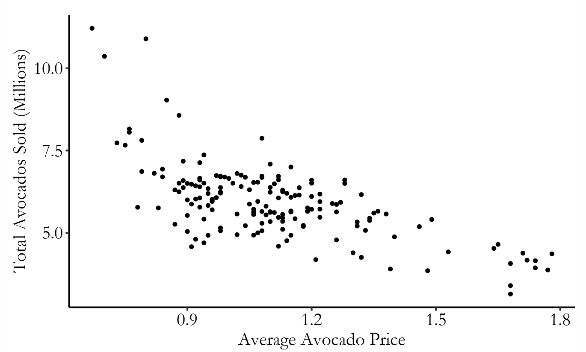
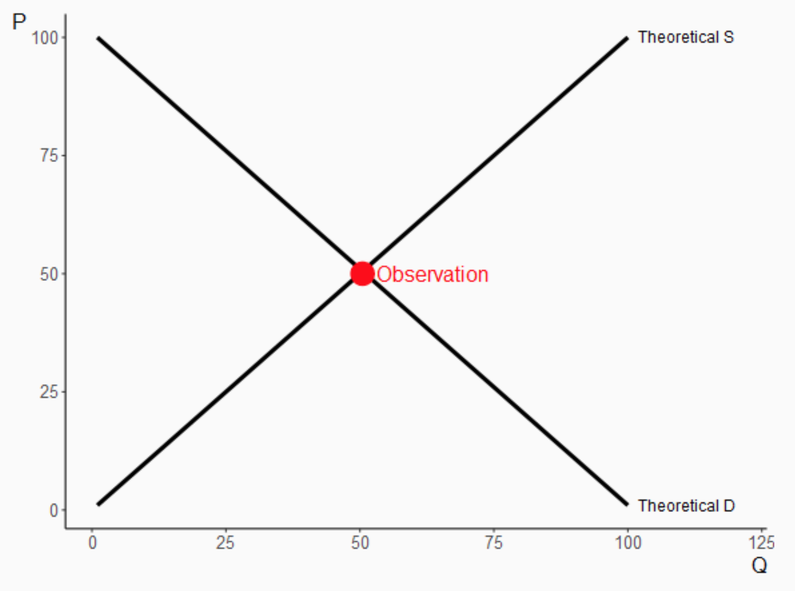

layout: true
background-image: url(images/ucab.png)
background-position: 100% 0%
background-size: 5%
---
class: inverse, center, middle

# Causalidad - Clase 2

## José Morales-Arilla y Carlos Daboín

#### Universidad Católica Andrés Bello 
#### Abril, 2022

```{r setup, echo = FALSE}
knitr::opts_chunk$set(fig.retina = 3, fig.width = 6, fig.asp = 0.618, out.width = "70%", fig.align = "center", warning = FALSE, message = FALSE)
```

---
# El abogado quiere probar (o refutar) una afirmación


.pull-left[
### ¿Cómo opera un juicio?
- ¿Cuál es el objetivo del abogado acusador?
  - Probar una afirmación.

- ¿Cuál es el objetivo del abogado defensor?
  - Poner en duda la afirmación.

- ¿Quién tiene el "peso de la prueba"?
  - El abogado acusador.
]

--

.pull-right[
### ¿Cómo se estructuran los argumentos?
1. Afirmación:
  - "Fulanito mató a Menganito"
2. Razonamiento:
  - "Fulanito le tenía culebra"
3. Evidencia:
  - "Fulanito es el dueño de la pistola"

### ¿Por qué esa evidencia no es suficiente?
- Porque ese _hecho_ puede explicarse...
- ...aún si la afirmación es _falsa_.
  - "A Fulanito le pudieron robar la pistola". 
]

---
# El investigador quiere responder una pregunta


.pull-left[
### ¿Cuál es el trabajo de un investigador?
1. Plantear una pregunta:
  - ¿La presencia policial reduce el crimen?

2. Ofrecer una teoría:
  - $\uparrow$ Policías $\to$ $\uparrow$ Prob. aprehensión $\to$ $\downarrow$ Crimen

3. Mostrar datos empíricos:
  - Menos crimen en zonas con más policías.
]

--

.pull-right[
### ¿Quién es el abogado defensor?
- "La comunidad científica".
  - Editor/Árbitros en revistas académicas.
- Proceso contencioso.

### ¿Por qué esa evidencia no es suficiente?
- Porque ese _hecho_ puede explicarse...
- ...aún si la afirmación es _falsa_.
  - Las zonas con más policías son más ricas.

]

--
### El problema de "identificación": El peso de la prueba de los investigadores.
- La investigación debe ofrecer evidencia que solo pueda explicarse bajo una respuesta a la pregunta.

---

# Tipos de evidencia empírica
.pull-left[
### Evidencia cualitativa
Los datos y su análisis no son numéricos
- Entrevistas
- Focus groups
- Casos de estudio
- Análisis comparativo
- Etnografías

Prevalente en la mayoría de las ciencias sociales
]

--

.pull-right[
### Evidencia cuantitativa
Los datos y su análisis son numéricos
- Teoría y práctica de la medida
- Cuantificación de la evidencia cualitativa
- Descripción numérica de características
- Descripción numérica de relaciones
- Cuantificación de la incertidumbre

Prevalente en la mayoría de las ciencias naturales
]

--

### Este curso: Aplicación de evidencia cuantitativa para preguntas en las ciencias sociales.

- Más establecido en la economía, pero creciente en muchas otras ciencias sociales.
- Ciencias políticas, epidemiología, psicología, sociología, antropología, etc.

---
# El diseño de la investigación depende de la pregunta

### Preguntas descriptivas
- Sobre una característica: "¿Cuál es la tasa de criminalidad en Venezuela?"
- Sobre asociaciones entre características: "¿Las parroquias más pobres son más violentas en Venezuela?"

--

### Preguntas causales
- "¿Cuál es el efecto de la pobreza sobre la violencia en Venezuela?"

--

### ¿Cuál es la diferencia entre la segunda pregunta y la tercera?

--

- La segunda implica *Correlación*, la tercera implica *"correlación bajo manipulación"* (**Causalidad**).

--

### Este curso: Aplicación de evidencia cuantitativa para preguntas **causales** en las ciencias sociales.

---
# Características de una buena pregunta de investigación:

.pull-left[
### 1. Puede responderse.
Es posible que existan datos en el mundo que nos permitan responder la pregunta.
- "¿Quién es mejor, Cristiano o Messi?"
  - Imprecisión, espacio para la subjetividad.
- "¿Quién participó en más goles entre 2005 y 2020?"
  - Preciso, medible. 
  - Ayuda a responder quien es mejor.
- "¿Cuál fue el PIB de Venezuela y Perú en 2013?"
  - "¿A que tipo de cambio?" vs. "Ya te lo busco".
- Estructura + Datos disponibles + Escala viable.
]

--

.pull-right[
### 2. Es relevante.
Si la respondemos, va a mejor nuestro entendimiento sobre como funciona el mundo.
- Informa un debate teórico, responde un por qué.
- Nos lleva de una teoría a una hipótesis.
- Si esta teoría es cierta, el mundo debería ser así...
- Pregunta: ¿Cómo se comporta el mundo? 
  - Hipótesis: El mundo es como sugiere la teoría.
  - Ahora buscamos los datos y vemos.
- Si empezamos a caminar hacia el este y llegamos al mismo sitio: ¿Qué teoría refutamos?
]

--

### La teoría de la tía: "Los pobres llevan el barrio en la cabeza" $\to$ ¿Pregunta de investigación?

---
# Teoría $\to$ Hipotesis $\to$ Pregunta

### Teoría: Planteamiento general sobre el funcionamiento de cierto fenómeno

- "La tierra es esférica".
  
### Hipótesis: Afirmación sobre como debe fucionar el mundo *solo* si la teoría es cierta
  - "Si te mueves en la misma dirección por el tiempo suficiente, terminarás en el mismo sitio".
  
### Pregunta: Cuestionamiento empírico sobre el funcionamiento del mundo
  - "¿Dónde ha terminado la gente que se ha movido en la misma dirección?".

--

### ¿Cuál viene primero en el proceso de investigación?
- En teoría, la teoría viene primero. En la práctica...

---
# Enfoque bayesiano para evaluar una pregunta:

### $P(Teoría | Evidencia) = \frac{P(Evidencia | Teoría) * P(Teoría)}{P(Evidencia)}$

- Nunca vemos el proceso que genera los datos, y no sabemos si ese proceso es consistente con nuestra teoría.
- Solo vemos los datos, a los que podemos hacer preguntas: ¿Cuáles son las posibles respuestas a tu pregunta?
  - "La gente que se mueve en la misma dirección terminó en el mismo sitio".
  - "La gente que se mueve en la misma dirección no terminó en el mismo sitio".
- ¿Cambia la probabilidad de que la teoría sea cierta con distintas respuestas?
  - ¿P(Teoría|Evidencia)>>P(Teoría)?, ¿Evidencia $\not\perp$ Teoría?

--

### Ejemplos:
- Si encontramos que la gente que se mueve en la misma dirección termina en el mismo sitio: 
  - ¿Cambia la probabilidad de que la tierra sea redonda?
- Si encontramos que la gente que nace en el barrio deja de ser pobre después de mudarse del barrio:
  - ¿Cambia la probabilidad de que la teoría de la tía sea cierta?

---
# Ventas de aguacates en California

.center[]

--

### ¿Qué nos dice esta figura? ¿Qué teoría(s) informa?

---
# Oferta y demanda operan al mismo tiempo

.center[]

--

### ¿Qué variación nos da la elasticidad de demanda? ¿y la de oferta?

---
# Identificación de efectos causales = aislar la variación correcta

### Precios y cantidades se mueven por muchas razones.

- Oferta y demanda se mueven de forma simultanea.
- Cantidades transadas $\not =$ Cantidades demandadas $\not =$ Cantidades ofrecidas.

--
### Se puede aislar la variación en cantidades producto de cambios en demanda u oferta.

- Sequías en México reducen la oferta. Caídas del ingreso reducen la demanda.

--

### Identificación: Teoría y supuestos para aislar la variación de interés en tu pregunta de investigación.
- Teoría sobre el proceso de generación de datos: Oferta y demanda.
- Supuestos: Sequías solo afectan el precio porque restringen la oferta.
- Correlación entre las cantidades explicadas por las sequías con los precios = Elasticidad (Efecto causal)
  - Las sequías son un **instrumento** para cambios en la oferta de aguacates. Más respecto más adelante.

---
# Si la correlación no es causalidad, ¿Qué es la correlación?

### Marco de resultados potenciales (Potential Outcomes Framework):

- $Y_i$: Valor de variable resultado $Y$ para el individuo $i$. $Y$ es un valor continuo.
- $T_i$: Valor de variable de tratamiento $T$ para el individuo $i$. $T$ es una variable binaria.
- $Y_i^0$: Valor de $Y$ para el individuo $i$ si no recibe el tratamiento.
- $Y_i^1$: Valor de $Y$ para el individuo $i$ si recibe el tratamiento.
- $Y_i^1-Y_i^0$: Efecto del tratamiento sobre el individuo $i$.

--

### Problema fundamental de la inferencia causal es que $Y_i^1-Y_i^0$ no se puede observar.
  
  .center[ $ID$  | $T_i$ | $Y_i^0$ | $Y_i^1$ | $Y_i^1 - Y_i^0$ | $Y_i$
            ------------- | ------------- | ------------- | ------------- | ------------- |
            1  | 1 | <span style="color:red">20</span> | 23 | <span style="color:red">3</span> | 23 
 2  | 1 | <span style="color:red">50</span> | 57 | <span style="color:red">7</span> | 57
  3  | 0 | 15 | <span style="color:red">17</span> | <span style="color:red">2</span> | 15
    4  | 0 | 23 | <span style="color:red">31</span> | <span style="color:red">8</span> | 23

  ]

---
# Si la correlación no es causalidad, ¿Qué es la correlación?

### El investigador necesita evidencia general del efecto:
- $E[Y_i^1 - Y_i^0]$: Efecto promedio del tratamiento (ATE).
- En la data, nunca podremos calcular el promedio de $Y_i^1 - Y_i^0$.
- Pero si podremos calcular $\bar{Y}_i^1=\frac{\sum_1^NY_i*T_i}{\sum_1^NT_i}$ y $\bar{Y}_i^0=\frac{\sum_1^NY_i*(1-T_i)}{\sum_1^N(1-T_i)}$
- Estas son las aproximaciones muestrales de $E[Y_i^1|T_i = 1]$ y $E[Y_i^0|T_i=0]$.
  - $E[Y_i^1|T_i = 1]$: Valor esperado de $Y$ si se recibe el tratamiento para los que reciben el tratamiento.
    - $E[Y_i^0|T_i = 0]$: Valor esperado de $Y$ si no se recibe el tratamiento para los que no reciben el tratamiento.
- $E[Y_i^1|T_i=1]-E[Y_i^0|T_i=0]$: Diferencia esperada entre promomedios grupales (EDGM) = **Correlación**.

--

### La pregunta es si $E[Y_i^1|T_i=1]-E[Y_i^0|T_i=0]$ = $E[Y_i^1-Y_i^0]$ 
- Es decir, la pregunta es si correlación es igual a la causalidad (EDGM =? ATE)
  
---
# Si la correlación no es causalidad, ¿Qué es la correlación?

### $E[Y_i^1|T_i=1]-E[Y_i^0|T_i=0] =$
### $\underbrace{E[Y_i^1|T_i=1]-E[Y_i^0|T_i=1]}_{\text{Efecto promedio sobre los tratados (ATT)}}+ \underbrace{E[Y_i^0|T_i=1]-E[Y_i^0|T_i=0]}_{\text{Sesgo de selección (Selection bias)}}$
- $E[Y_i^0|T_i=1]$: Valor esperado de $Y$ de no recibir el tratamiento entre los que si reciben el tratamiento.

### $\underbrace{\text{EDGM}}_{\text{Correlación}} = \underbrace{ATE}_{\text{Causalidad}} + \underbrace{(ATT-ATE)}_{\text{Selección sobre retornos}} + \underbrace{SB}_{Sesgo}$

---
# Condiciones para que Correlación = Causalidad

### Concepto de independencia estadística: Si A $\perp$ B; P(A|B) = P(A)

--

### Independencia entre tratamiento y resultados potenciales.
- Si $\{Y_i^0; Y_i^1\}\perp T_i$, entonces $E[Y_i^x|T_i=x]=E[Y_i^x]  \hspace{.5cm} \forall x\in \{0, 1\}$. 
  - $\underbrace{E[Y_i^1|T_i=1]-E[Y_i^0|T_i=1]}_{\text{ATT}} =E[Y_i^1]-E[Y_i^0] = \underbrace{E[Y_i^1-Y_i^0]}_{\text{ATE}}$
  - $\underbrace{E[Y_i^0|T_i=1]-E[Y_i^0|T_i=0]}_{\text{SB}}=0$
  
### $\underbrace{E[Y_i^1|T_i=1]-E[Y_i^0|T_i=0]}_{\text{Correlación}} = \underbrace{ATE}_{\text{Causalidad}} + \underbrace{(ATT-ATE)}_{0} + \underbrace{SB}_{0}$

---
# Condiciones para que Correlación = Causalidad

### Si sabes que el tratamiento es independente a los resultados potenciales:
- La diferencia esperada entre los promedios del grupo de tratados y no tratados (Correlación)...
- ...es un estimador insesgado (consistente) del efecto promedio del tratamiento (Efecto causal de interés).
- Puedes observar el promedio de algo que no puedes observar (efectos individuales del tratamiento).

--

### Pregunta trampa #1:
- ¿Es posible que ATT = ATE, pero SB $\not =$ 0? 
  - Pista: Imagínense que todos los argentinos fueran igual de rumberos que Carlos.

--

### Pregunta trampa #2:
- Estamos haciendo estadística: ¿Qué le falta a la ecuación $Corr = ATE + (ATT-ATE) + SB$?  
  - Pista: El elemento que falta se diluye con muestras más grandes.

---
# Tratamiento $\perp$ resultados potenciales en la data:
.pull-left[
```{r}
library(tidyverse)

df <- data.frame(
  eY = rnorm(10000), 
  T = sample(c(0,1), 10000, 
             replace = T)) %>%
  mutate(Y_0 = eY, 
         Y_1 = eY + 1,
         Y = ifelse(T == 1, 
                    Y_1 , Y_0),
         dY = Y_1 - Y_0)

ATE = df %>% summarize(mean(dY))
EDGM = df %>% filter(T == 1) %>% 
  summarize(mean(Y)) -
  df %>% filter(T == 0) %>% 
  summarize(mean(Y))
```
]

--

.pull-right[
### El ATE debería ser igual a `r ATE`. 

### El EDGM da `r round(EDGM, digits = 2)`.

```{r, echo = FALSE}
library(dagitty)
library(ggdag) 

dagify(Y ~ eY + T) %>% 
  ggplot(aes(x = x, y = y, xend = xend, yend = yend)) +
  geom_dag_point() + 
  geom_dag_edges_arc() +
  geom_dag_text() +
  theme_dag()
```
]

---

# Tratamiento $\not\perp$ resultados potenciales en la data:
.pull-left[
```{r}
df <- data.frame(
  Z = runif(10000),
  eY = runif(10000)) %>% 
  mutate(Y_0 = eY + Z, 
         Y_1 = Y_0 + 1,
         T = Z > .7,
         Y = ifelse(T == 1,Y_1, Y_0),
         dY = Y_1 - Y_0
         )

ATE = df %>% summarize(mean(dY))
EDGM = df %>% filter(T == 1) %>% 
  summarize(mean(Y)) -
  df %>% filter(T == 0) %>% 
  summarize(mean(Y))
```
]

--

.pull-right[
### El ATE debería ser igual a `r ATE`. 

### El EDGM da `r round(EDGM, digits = 2)`.

```{r, echo = FALSE}
library(dagitty)
library(ggdag) 

dagify(Y ~ eY + T + Z,
       T ~ Z) %>% 
  ggplot(aes(x = x, y = y, xend = xend, yend = yend)) +
  geom_dag_point() + 
  geom_dag_edges_arc() +
  geom_dag_text() +
  theme_dag()
```

]

---
# ¿Qué aprendimos hoy?

### 1. Problema de identificación: Peso de la prueba del investigador.

### 2. Características de una buena pregunta de investigación

### 3. Identificación de efectos causales: Usar teoría y supuestos para aislar la variación correcta.

### 4. Marco de resultados potenciales y componentes de la correlación.

### 5. Condiciones bajo las que correlación = causalidad. 

---

class: center, middle

# Gracias
