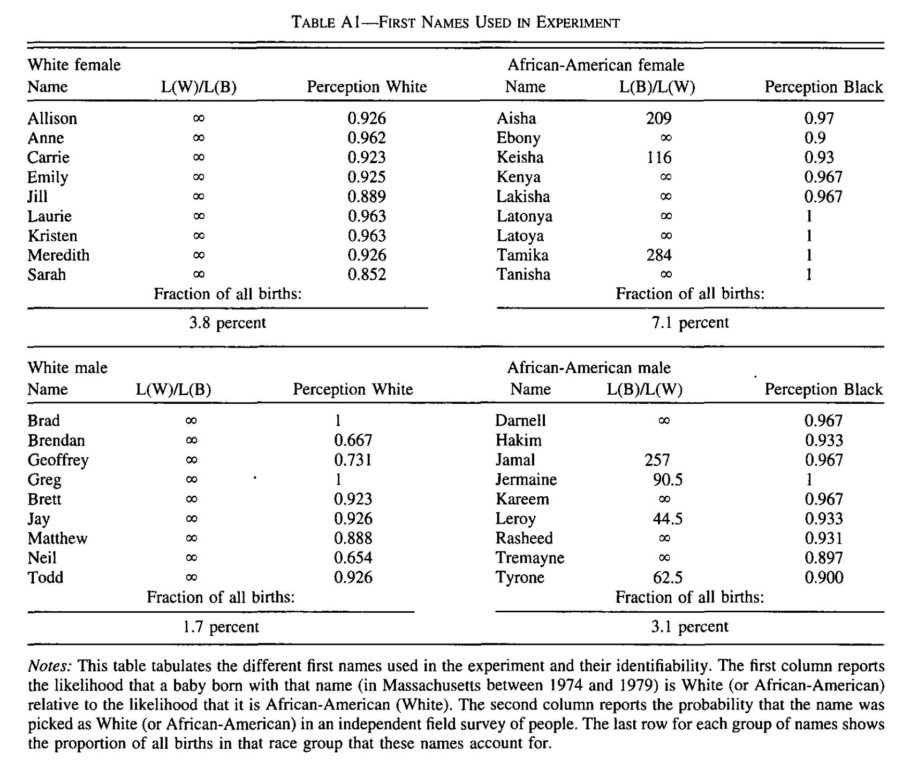
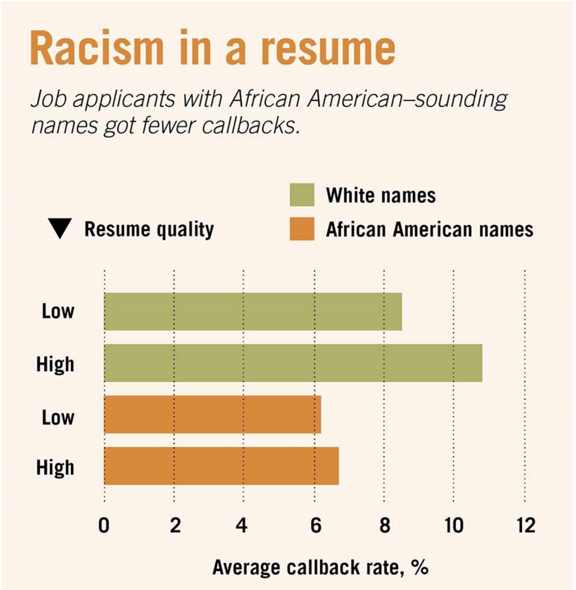
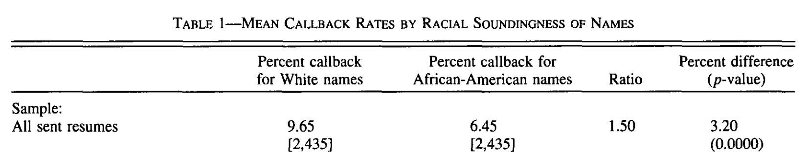
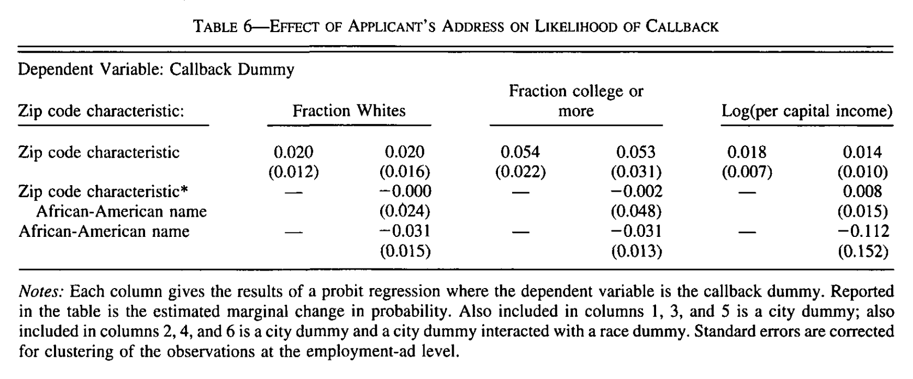
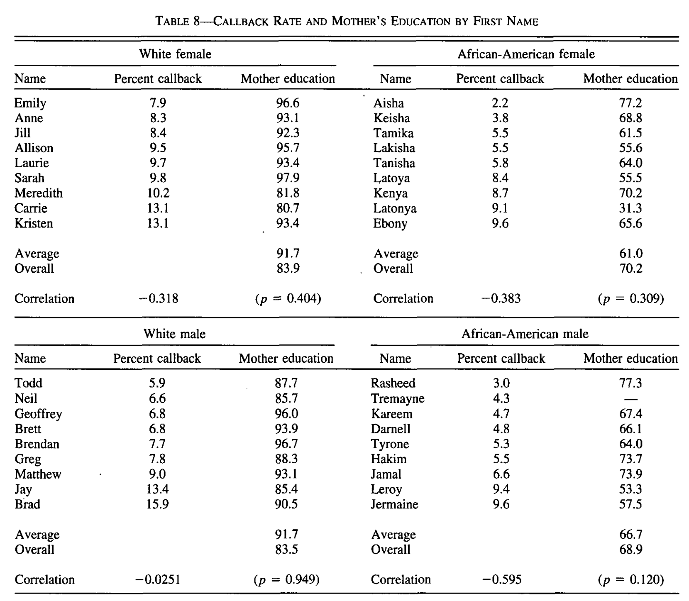

layout: true
background-image: url(images/ucab.png)
background-position: 100% 0%
background-size: 5%
---
class: inverse, center, middle

# Causalidad - Clase 3

## José Morales-Arilla y Carlos Daboín

#### Universidad Católica Andrés Bello 
#### Mayo, 2022

```{r setup, echo = FALSE}
knitr::opts_chunk$set(fig.retina = 3, fig.width = 6, fig.asp = 0.618, out.width = "70%", fig.align = "center", warning = FALSE, message = FALSE)
```

---
# ¿Qué aprendimos la clase pasada?

### 1. Problema de identificación: Peso de la prueba del investigador.

### 2. Características de una buena pregunta de investigación

### 3. Identificación de efectos causales: Usar teoría y supuestos para aislar la variación correcta.

### 4. Marco de resultados potenciales y componentes de la correlación.

### 5. Condiciones bajo las que correlación = causalidad. 

---
# Condiciones bajo las cuales correlación = causalidad.

### ¿Cuáles son los componentes de la correlación?
- $\underbrace{\text{EDGM}}_{\text{Correlación}} = \underbrace{ATE}_{\text{Causalidad}} + \underbrace{(ATT-ATE)}_{\text{Selección sobre retornos}} + \underbrace{SB}_{Sesgo}$

### Bajo la condición de que $E[Y_i^x|T_i=x]=E[Y_i^x]$:
$\underbrace{E[Y_i^1|T_i=1]-E[Y_i^0|T_i=0]}_{\text{Correlación}} = \underbrace{ATE}_{\text{Causalidad}} + \underbrace{(ATT-ATE)}_{0} + \underbrace{SB}_{0}$ 

--

### ¿Qué significa eso en cristiano?
- Tratamiento $\perp$ resultados *potenciales* en la data.
- Causa de interés es independiente de los otros determinantes del resultado de interés.

---
# Diagramas causales:

### También conocidos como Gráficas Dirigidas Acíclicas (DAGs)
- Una forma de representar de forma gráfica las relaciones causales...
- ...y potenciales problemas a la hora de interpretar correlaciones.

--

.pull-left[
### Tratamiento $\not\perp$ resultados potenciales:
```{r, echo = FALSE}
library(dagitty)
library(ggdag) 
library(tidyverse)

dagify(Y ~ eY + T + Z,
       T ~ Z) %>% 
  ggplot(aes(x = x, y = y, xend = xend, yend = yend)) +
  geom_dag_point() + 
  geom_dag_edges_arc() +
  geom_dag_text() +
  theme_dag()
```
]

.pull-right[
### Tratamiento $\perp$ resultados potenciales:
```{r, echo = FALSE}
dagify(Y ~ eY + T) %>% 
  ggplot(aes(x = x, y = y, xend = xend, yend = yend)) +
  geom_dag_point() + 
  geom_dag_edges_arc() +
  geom_dag_text() +
  theme_dag()
```
]
---
# Evidencia experimental: $T_i$ $\perp$ $Y_i^x$ *por diseño*.

### El experimento ideal tiene tres componentes:
1. Muestra aleatoria de una población de interés
2. Asignación aleatoria del tratamiento
3. Protocolo experimental es respetado a la perfección

--

### ¿Qué te compra la muestra aleatoria? Validez externa.
- Representatividad de la población de interés.

--

### ¿Qué te compra la asignación aleatoria del tratamiento? Validez interna.
- La única diferencia **en promedio** entre grupos de tratamiento y control es que una recibió el tratamiento.
- Es decir, recibir el tratamiento es independiente de los otros determinantes de la variable resultado: $T$ $\perp$ $Y^0, Y^1$.
- ATE = EDGM: Efecto causal de T es la diferencia en la media de Y en el grupo en que T = 1 y el grupo en que T = 0.

---
# Bertrand y Mullainathan (2004)

### ¿Cuál es el hecho estilizado que motiva el estudio?

--

- Tasa de desempleo entre Afro-Americanos 2x desempleo entre blancos. 
- Salarios entre afro-americanos empleados son 25% menores que entre blancos.

--

### ¿Qué pregunta se hacen?

--

- ¿Hay discriminación racial en el mercado laboral norteamericano?

--

### ¿Por qué el hecho estilizado no responde la pregunta?

--

- Raza puede relacionarse con otros determinantes de los resultados en el mercado laboral.
  - ¿Las universidades públicas discriminan a los pobres?
  - No necesariamente, a lo mejor se basan estrictamente en exámenes de admisión.
  - Es decir, hay una teoría alternativa a la discriminación que puede explicar la correlación.

---
# Teoría $\to$ Hipótesis $\to$ Pregunta

### Teoría: Planteamiento general sobre el funcionamiento de cierto fenómeno.

- "Los empleadores discriminan a los Afro-americanos."

### Hipótesis: Afirmación sobre como debe fucionar el mundo *solo* si la teoría es cierta.

- "Los empleadores consideran la raza a la hora de contratar trabajadores."

### Pregunta: Cuestionamiento empírico sobre el funcionamiento del mundo
- "¿Cuál es el efecto de la raza de un trabajador sobre sus chances de conseguir trabajo?".

---
# Identificación: Aislar la variación correcta

```{r, echo = FALSE}
dagify(Emp. ~ Cap. + Raza + eEmp.,
       Cap. ~ Raza) %>% 
  ggplot(aes(x = x, y = y, xend = xend, yend = yend)) +
  geom_dag_point() + 
  geom_dag_edges_arc() +
  geom_dag_text() +
  theme_dag()
```

---
# Pregunta $\to$ Diseño de investigación

### Los experimentos son el "estandar de oro" para resolver preguntas causales. 
- Siempre es bueno empezar preguntándose "¿Cuál sería el experimento ideal si no tuviese limitaciones?"

--

### ¿Cuál creen que sería el experimento ideal para resolver esta pregunta?

--

- ¿Se puede asignar la raza aleatoriamente a los trabajadores?

--

### ¿Qué hicieron Bertrand y Mullainathan?

--

- Crear CVs falsos de calidad distinta:
  - Años de experiencia, honores, email, vacíos laborales, vecindarios de origen...
- Asignar nombres que sugieren raza aleatoriamente :
  - ¿Cómo lo determinaron?
- Enviarlos a avisos de empleo publicados en prensa:
  - Variación en industria, ocupación, vecindario de empleo, "Equal opportunity", etc.

---
# Debilidades: Del experimento ideal al experimento posible

--

### Problemas de medición de resultados:
- Llamadas para coordinar una entrevista $\not =$ Oferta de empleo o salario.

### Representatividad de los empleadores
- Mercado laboral de Boston y Chicago $\not =$ Mercado laboral de EEUU.

### Representatividad de los trabajadores
- Afroamericanos con nombres extremadamente afroamericanos $\not =$ todos los afroamericanos.

---
# Nombres por grupo racial para hombres y mujeres:
.pull-left[
.center[]
]
.pull-right[.center[]]

---
# Produzcamos los resultados principales del paper:
.pull-left[
```{r}
library(haven)
library(fixest)

# 1. Carga la data de Bertrand y Mullainathan (2004)
df <- read_dta("Mullainathan/lakisha_aer.dta")
df <- df %>% mutate(
  black = if_else(race == "b", 1, 0),
  white = if_else(race == "w", 1, 0),
  c_black = if_else(race == "b" & call == 1, 1, 0),
  c_white = if_else(race == "w" & call == 1, 1, 0))

# 2. Calcula el total de CVs y de llamadas por raza
t <- df %>% summarize(
  black = sum(black),
  white = sum(white),
  c_black = sum(c_black),
  c_white = sum(c_white))

# 3. Calcula la proporcion de llamadas por raza
prop_c_black <- t$c_black / t$black
prop_c_white <- t$c_white / t$white

# 4. Calcula el ratio y la diferencia en proporciones
ratio <- prop_c_white / prop_c_black
diff <- prop_c_black - prop_c_white
```
]

--

.pull-right[
### Resultados:
- Proporción de llamadas afro-americanos: `r round(prop_c_black, digits = 4)*100`%.
- Proporción de llamadas blancos: `r round(prop_c_white, digits = 4)*100`%.
- Diferencia: `r round(prop_c_black - prop_c_white, digits = 4)*100`%.
- Ratio: `r round(prop_c_white / prop_c_black, digits = 2)`.

.center[]

### 50% más llamadas a CVs de blancos.
- Diferencia grande.
- ¿Estadísticamente significativa?
]
---
# Test de igualdad en proporciones $\sim$ Regresión
.pull-left[
### Test de igualdad en proporciones:
```{r}
# 5. Test de proporciones
prop.test(x = c(t$c_black, t$c_white), 
          n = c(t$black, t$white),
          correct = TRUE)
```
]

.pull-right[
### Regresión: $C_i=\beta_0+\beta_1*T_i+\epsilon_i$
```{r}
# 6. Regresion de llamadas por raza
feols(call ~ black, df)
```
]

---
# ¿Cómo se aleatoriza el tratamiento?

### Literalmente:
- Asignar un número aleatorio a cada observación.
- Asignar tratamiento al 50% de observaciones con números más altos.

--

### ¿Cómo se sabe si la aleatorización funcionó?

--

- El tratamiento debe ser independiente de las características observadas.
- Todos los RCTs empiezan con "tests de balance" en el tratamiento.

--

### ¿Cómo aleatorizaron Bertrand y Mullainathan (2004)?

--

- 1300 Anuncios de empleo.
- 4 CVs para cada anuncio:
  - Dos de "alta calidad" y dos de "baja calidad".
  - Uno de alta calidad y uno de baja calidad asignados aleatoreamente a un nombre afro-americano.
  
---
# ¿Funcionó la aleatorización en Bertrand y Mullainathan (2004)?

#### ¿Cuál es la preocupación principal? Raza $\perp$ Características del CV: Comparar Columnas 2 y 3 en Tabla 3!

--

.pull-left[
```{r}
vars <- c("call", "honors", "email",
          "military", "volunteer", "empholes")
COEFS <- c()
CI_lo <- c()
CI_hi <- c()
for (i in 1:length(vars)){
  Y <- vars[i]
  mod <- feols(as.formula(paste(vars[i],'~ black')), df)
  coef <- mod$coefficients[2]
  se <- mod$se[2]
  ci_lo <- coef - 1.96 * se
  ci_hi <- coef + 1.96 * se
  COEFS <- c(COEFS,coef)
  CI_lo <- c(CI_lo, ci_lo)
  CI_hi <- c(CI_hi, ci_hi)
}

baseline_tests <- tibble(
  variables = vars, beta = COEFS,
  ci_lo = CI_lo, ci_hi = CI_hi,
  null = if_else(ci_lo < 0 & ci_hi > 0, 1, 0)
)
```
]

--
.pull-right[
```{r, out.width = "90%"}
ggplot(baseline_tests, aes(y = variables, x = beta)) +
  geom_point() + geom_errorbarh(
    aes(xmin = ci_lo, xmax = ci_hi), 
    height = 0) +
  geom_vline(xintercept = 0, linetype = 'dashed')
```
]

---
# ¿Cuál es el efecto de la calidad de los CVs para distintas razas?

.pull-left[
### Efecto de la calidad para blancos
```{r}
df_white <- df %>% filter(black == 0)
hw <- feols(call ~ h, df_white)
```

Entre CVs de blancos, tener una calidad alta aumenta la probabilidad de recibir una llamada en `r round(hw$coefficients[2], digits = 4)*100`%, y el efecto es estadísticamente significativo. 

]

.pull-right[
### Efecto de la calidad para afroamericanos
```{r}
df_black <- df %>% filter(black == 1)
hb <- feols(call ~ h, df_black)
```

Entre CVs de afroamericanos, tener una calidad alta aumenta la probabilidad de recibir una llamada en `r round(hb$coefficients[2], digits = 4)*100`%, y no es estadísticamente distinto de 0. 

]

--

## Mérito $\to$ Éxito... entre los blancos!

---
# De la teoría a la pregunta... y de vuelta a la teoría
### ¿Cuál era la pregunta?
- "¿Cuál es el efecto de la raza de un trabajador sobre sus chances de conseguir trabajo?".
- Respuesta: Empleadores llaman a trabajadores blancos 50% más que a trabajadores con nombre afroamericano.

### ¿Este resultado prueba la hipótesis/teoría?
- Teoría: "Los empleadores discriminan a los Afro-americanos."
- Hipótesis: "Los empleadores consideran la raza a la hora de contratar trabajadores."

--

### Problema de identificación: ¿Puede explicarse este resultado aún si la teoría es falsa?
- ¿Qué teoría puede explicar estos resultados en ausencia de discriminación racial?

--

  - "Acá no hay racismo, pero hay clasismo"

---
# Si el problema fuera clasismo y no racismo...

--
.pull-left[
### Los CV con nombres afroamericanos asociados a "mejores" vecindarios o para actividades con baja interacción interpersonal deberían ser más exitosos... Pero no lo son (Tablas 6 y 7).

.center[]
]

--

.pull-right[
### Los CV con nombres afroamericanos asociados a madres más educadas deberían ser más exitosos... Pero no lo son (Tabla 8).
.center[]
]

---
# Mecanismos sobre como opera la teoría (Sección IV, Parte C)

### Resultados confirman teoría de discriminación racial, pero hay distintos "tipos" de discriminación racial.

--

### Discriminación basada en gustos (Gary Becker, 1961)
- Debería haber heterogeneidad entre industria u ocupaciones basado en interacciones personales... pero no hay.

--

### Discriminación estadística (Altonji y Black, 1999)
- Señales de calidad menos precisas para afroamericanos.
  - Pero las características asociadas a ambas razas son igual de "precisas" - son las mismas en promedio.
- La misma característica podría señalizar menos capacidad si estas son más fáciles de adquirir para un grupo 
  - Por ejemplo, si afroamericanos las reciben no por mérito sino por discriminación afirmativa.
  - ¿"Empleado del mes" vs. Computación? ¿Experiencia laboral? Falta heterogeneidad esperada.

### Alternativa simple sugerida: Búsqueda lexicográfica (Paro de leer si veo nombre afro-americano).

---
# ¿Qué aprendemos de BM2004 sobre los RCTs en general?

### Asignación aleatoria del tratamiento garantiza interpretación causal de la correlación.
- Correlación entre raza sugerida y tasa de llamadas es el efecto causal de la raza sobre la tasa de llamadas.

### Explorar variación adicional permite evaluar la identificación causal de nuestra teoría.
- Diferencia en tasa de llamada entre razas puede ser por "clasismo" y no por "racismo". 
- Pero si fuera clasismo esperaríamos que diferencias raciales se atenuaran con marcadores observables de clase...
- ... y no se atenúan. Así que los resultados son más consistentes con la hipótesis de racismo.

### Explorar variación adicional permite precisar mecanismos y decantar entre teorías más precisas.
- Resultados son consistentes con teoría de discriminación racial.
- Pero discriminación racial puede ser por gustos, por discriminación estadística, o por proceso lexicográfico.
- Falta de heterogeneidades es más consistente con la teoría de discriminación lexicográfica.

---
# Evidencia experimental: $T_i$ $\perp$ $Y_i^x$ *por diseño*.

### El experimento ideal tiene tres componentes:
1. Muestra aleatoria de una población de interés
2. Asignación aleatoria del tratamiento
3. Protocolo experimental es respetado a la perfección

### ¿Qué te compra que el protocolo experiental sea respetado a la perfección?
- Que no hay diferencia entre asignación al tratamiento y tratamiento. 
- Esto es verdad en BM2004 - Un CV asignado a un grupo racial va a tener el nombre que sugiere raza. 
- Esto suele ser cierto en contextos médicos - A quien se le asigna la vacuna se le pone la vacuna.

### Los protocolos experimentales rara vez se cumplen a la perfección en contextos sociales:
- Lo cual puede ser problemático si el efecto del tratamiento no es igual para todo el mundo.

---
# Caso hipotético: ¿Ir al gimnasio $\to$ bajar de peso?
--
.pull-left[
### ¿Cuál sería el experimento ideal?
]

--

.pull-right[
- Muestra aleatoria de la población.
- Asignación aleatoria de ir al gimnasio.
  - Asignados a ir al gimnasio están obligados a ir al gimnasio.
  - Asignados a grupo de control obligados a no ir al gimnasio.
- Diferencia en peso promedio un mes después = Efecto promedio del gimnasio sobre el peso.
]

--

.pull-left[
### ¿Se puede garantizar este protocolo experimental?
]

--

.pull-right[
- No... porque la gente tiene esto que se llama derechos humanos.
- No puedes obligar al que se le asignó gimnasio a ir al gimnasio.
- No puedes obligar al que se le asignó no ir al gimnasio a que no vaya.
]

---
# Caso hipotético: ¿Ir al gimnasio $\to$ bajar de peso?
--
.pull-left[
### Del experimento ideal al experimento posible: ¿Qué podemos hacer?
]

--

.pull-right[
- Muestra aleatoria de la población.
- Asignación aleatoria de **incentivos** para ir al gimnasio.
  - Asignados reciben pago condicional en ir al gimnasio. (ej: Gimnasio gratis)
  - Asignados a grupo de control no tienen el incentivo.
]

--

.pull-left[
### Tres (cuatro) tipos de personas
]

--

.pull-right[
- Siempre tratados: Van al gimnasio con o sin incentivo.
- Nunca tratados: No van al gimnasio con o sin incentivo.
- Cumplidores: Van al gimnasio solo si reciben el incentivo.
- (Desafiadores: Van al gimnasio solo si están en el grupo de control.)
]

---
# Caso hipotético: ¿Ir al gimnasio $\to$ bajar de peso?
--
.pull-left[
### ¿Qué capturamos con la diferencia entre quienes recibieron el incentivo y quienes no recibieron el incentivo?
]

--

.pull-right[
- Diferencia de medias es el efecto de la "intención de tratar" (ITT).
- Distinto al efecto promedio del tratamiento (ATE)
  - ITT es producto del comportamiento de los cumplidores, solo un grupo del total.
]

--

.pull-left[
### ¿Qué porcentaje de la gente son los cumplidores?
]

--

.pull-right[
- La diferencia en la proporción de gente que va al gimnasio...
- ...entre el grupo que recibió el incentivo y el que no recibió el incentivo.
]

.pull-left[
### ¿Cuál es el efecto promedio del tratamiento sobre los cumplidores?
]

--

.pull-right[
- Efecto "Local" Promedio del Tratamiento (LATE)
- $LATE = \frac{ITT}{\% C}$
- $LATE = ATE$ solo si efectos causales son homogeneos. No siempre es un supuesto sensato.
]

---
# ¿Qué aprendimos hoy?

### RCTs son el "Estandar de oro" para la evaluación de efectos causales.

### Siempre empezamos preguntándonos: ¿Cuál sería el experimento ideal?

### Del experimento ideal pasamos al experimento (o al diseño de investigación) posible.

### Muestreo aleatorio compra validez externa, tratamiento aleatorio compra validez interna.

### Exploración de variación adicionar sirve para identificar teoría y decantar sus detalles.

### No siempre hay cumplimiento perfecto del protocolo experimental.

### En ese caso, se identifica el efecto causal "local" para los "cumplidores" (LATE).

---
class: center, middle

# Gracias
