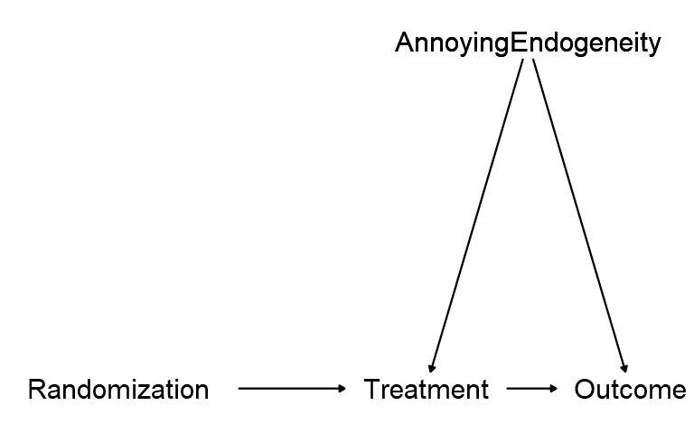

layout: true
background-image: url(images/ucab.png)
background-position: 100% 0%
background-size: 5%
---
class: inverse, center, middle

# Causalidad - Clase 5

## José Morales-Arilla y Carlos Daboín

#### Universidad Católica Andrés Bello 
#### Mayo, 2022

```{r setup, echo = FALSE}
knitr::opts_chunk$set(fig.retina = 3, fig.width = 6, fig.asp = 0.618, out.width = "70%", fig.align = "center", warning = FALSE, message = FALSE)
library(tidyverse)
library(fixest)
library(haven)
```

---
# ¿Qué aprendimos la clase pasada?


### No siempre podemos desarrollar evidencia experimental.

### La evidencia cuasi-experimental se basa en datos observacionales y supuestos de identificación.

### Supuesto de que $T$ $\perp$ $Y^x$ en la naturaleza: Experimentos naturales (Africa).

### Supuesto de que $T$ $\perp$ $Y^x$ condicional en ciertas variables: "Cerrar puertas traseras" (Lalonde)

### ¿Qué puertas traseras hay que cerrar? Revisa tu teoría y tu modelo sobre la situación.

### ¿Cómo cerrar puertas traseras? 
#### - "Residualizar" la variación de la puerta trasera (Regresión con controles).
#### - Comparando observaciones en las que no hay variación en la puerta trasera (Matching)

---
# Dos maneras de "Cerrar puertas traseras":

### Residualizar la variación de la puerta trasera:
- Lo que hacemos con una regresión que "controla" por la puerta trasera.

### Seleccionar comparaciones donde no hay variación en la puerta trasera.
- Lo que hacemos a través de métodos de "pareo" (Matching).
- Escoge observaciones para las que los valores de X cambian, pero los valores de Z se mantienen muy similares.
- Si el tratamiento de interés X es binario, podemos utilizar las variables en Z para predecirlo, y luego evaluar el efecto del tratamiento controlando por la probabilidad de ser tratado (Propensity score matching).

### Ambos métodos se sustentan en el supuesto de independencia condicional entre $T$ y $Y^x$.
- Condicional en que no haya variación en la puerta trasera. 
- Lenguaje de manzanas con manzanas: "Manteniendo Z constante". "Si dos individuos tienen el mismo Z".

---
# Controlar por una variable binaria:


.center[]

---
# Controlar por una variable continua:

.center[<video src="images/Control2.mp4" width="50%" type="video/mp4" />]

### Ver animación [acá](https://twitter.com/nickchk/status/1274853247694467072).

---
# Matching por una variable continua

.center[]

---
# Efectos fijos
### Imagina que tienes un censo poblacional y te interesa el efecto de educación sobre ingreso. Te preocupa que la "calidad del gobernador" sea una puerta trasera: ¿Qué hacemos?
- Más educación <- Mejor gobernador -> Más ingresos
- ¿Cómo se mide la "calidad" del gobernador? Quizás no observable para el investigador.

--

### Podemos tomar efectos fijos por el estado:
- A cada observación le quitamos *la media de su estado* en educación e ingreso.
- La correlación entre el ingreso y la educación residual no viene explicada por la calidad del gobernador...
- ...o cualquier otra variable que tome igual valor para todos los individuos del mismo estado.

### El "estado" es una variable categórica:
- Factorizar: Convertir una variable categórica en N variables binarias - una vinaria por categoría, suman 1.

---
# Efectos fijos

.center[]

---
# ¿Por qué es difícil probar causalidad cerrando puertas traseras?

### Es muy probable que nuestra teoría identifique puertas traseras que no podemos cerrar.
- La relación entre educación e ingresos puede estar mediada por la "habilidad" de la persona.
- La habilidad de la persona no puede observarse, o no se midió cuando se registraron datos observacionales. 
- Esto ocurre a cada rato: Te interesa X -> Y, pero X <- U -> Y cuando U no es observable. 
- No se puede resolver sesgo de selección (variable omitida) cerrando la puerta. 

--

### Puede que nuestra teoría no capture todos los factores importantes por los que deberíamos controlar.
- Problema constante en la interacción con los árbitros (abogados defensores).
- Árbitros no nihilistas pero expertos van a saber de un millón de cosas por las que debiste haber controlado.
- Árbitros nihilistas no expertos van a decirte que "puede que haya otra cosa por la que controlar".

--

### ¿Qué podemos hacer entonces para probar causalidad ?
- De cerrar puertas traseras a aislar la variación correcta en la puerta delantera. 

---
# ¿Cuál es "la variación correcta" en la puerta delantera?

### Para entender el efecto de $X$ sobre $Y$, necesitamos variación "exógena" en $X$.
- Piensen en el ejemplo de Lalonde que vieron con Carlos la semana pasada.
- Lalonde tenía data experimental y data observacional del mismo $Y$ (Ingresos) y $X$ (Programa de formación).
- En data experimental, $X$ tenía un efecto positivo sobre $Y$.
- En data observacional **cruda**, $X$ se asociaba negativamente con $Y$.
- La relación natural entre participación en programas de formación e ingresos tiene puertas traseras.
- La relación entre la variación experimental en programas de formación y los ingresos **no tiene** puertas traseras.
- La variación experimental en $X$ es "Exógena" por diseño: $X$ $\perp$ $Y^x$. 

--

### Los experimentos inducen variación exógena en $X$, así que su correlación con $Y$ es causal. 

- Si no podemos correr experimentos, una alternativa a cerrar todas las "puertas traseras"...
- ...es aislar parte de la variación de $X$ que puede entenderse como exógena bajo supuestos plausibles.
- De toda la variación en $X$ en la data observacional, buscamos aislar su parte "plausiblemente exógena".
- Correlación entre variación "plausiblemente exógena" de $X$ con $Y$ sería causal (bajo supuestos de identificación).

---
# Visualmente...

.pull-left[
### Antes...
.center[]
]

--

.pull-right[
### Ahora...
.center[]
]

---
# El resto del curso trata sobre aislar variación exógena en $X$

### Aislar variación exógena en $X$ en datos de sección cruzada:
- Variables instrumentales.
- Discontinuidad en regresiones.

### Aislar variación exógena en $X$ en datos de panel:
- Regresiones de panel.
- Diferencia en Diferencias.
- Controles sintéticos.

### Cambio en el tipo de supuesto de identificación:
- Antes: Identificar y controlar por todas las puertas traseras posibles bajo supuesto de independencia condicional.
- Ahora: Correlación simple bajo supuesto de exogeneidad plausible.
- Si tenemos suerte, podemos descubrir el efecto de $X$ sobre $Y$ sin hacer tantos supuestos teóricos. 

---
# Variables instrumentales - Idea básica:
### Nos interesa el efecto de $X$ sobre $Y$, pero existen puertas traseras.

### Tenemos una variable $Z$ que vamos a llamar el "instrumento" o la "variable instrumental".

### La variable $Z$ va a ser un buen instrumento de $X$ a la hora de estimar el efecto de $X$ sobre $Y$ si...

### ... $Z$ se correlaciona con $X$... (**Relevancia del instrumento**)

### ... y no tiene puertas traseras con $Y$. (**Restricción de exclusión del instrumento**).

---
# Recordemos la tarea 1: Experimento con protocolo imperfecto.

### El DAG de la situación del experimento "Moving to opportunity" era:

.center[]

### Donde:
- $R$ es la asignacion aleatoria de un voucher.
- $X$ es la decisión de mudarse de barrio.
- $Y$ es el puntaje de bienestar psicológico unos años después del experimento.
---
# Recordemos la tarea 1: Experimento con protocolo imperfecto.

### El DAG de la situación del experimento "Moving to opportunity" era:

.center[]

### En este caso (experimental), $R$ es un buen instrumento de $X$.
- La variable instrumental $R$ causa a la variable "instrumentada" $X$. Es decir, es un instrumento **relevante**.
- $R$ no se relaciona con $Y$ sino a través de su efecto sobre $X$. Es decir, cumple con la **restricción de exclusión**.
  - $R$ es experimental + beneficio de $R$ a través de $X$ (mudarse) = Restricción de exclusión por diseño.
  
---
# Variables instrumentales fuera de un experimento:

### Situación: Queremos saber si $X \to Y$ con data observacional y de forma cuasi-experimental...

### ...y existen "puertas traseras" entre $X$ y $Y$.

--

### Pregunta: ¿Existe una variable $Z$ que haga lo mismo que la variable $R$ en la lámina pasada...

### ...a pesar de no ser asignada de forma aleatoria?

--

### En caso afirmativo: $Z$ se relaciona con $X$, y todo su efecto sobre $Y$ opera a través de $X$. 

### Podemos instrumentar a $X$ con el instrumento $Z$ para estimar el efecto de $X$ sobre $Y$. 

---
# ¿Cómo utilizo el instrumento $Z$ para estimar $X \to Y$ ?

### Paso 1: Explica a $X$ como función de $Z$ y quédate con la porción de $X$ explicada por $Z$.
#### - $X_i = \alpha_0 + \alpha_1 Z_i+\epsilon_i$ $\to$ $\hat{X_i} = \alpha_0 + \alpha_1 Z_i = X_i - \epsilon_i$. A esta regresión se le llama la "primera etapa". 

### Paso 2: Explica a $Y$ como función de $Z$ y quédate con la porción de $Y$ explicada por $Z$.
#### - $Y_i = \gamma_0 + \gamma_1 Z_i+\kappa_i$ $\to$ $\hat{Y_i} = \gamma_0 + \gamma_1 Z_i = X_i - \kappa_i$. A esta se le llama la "segunda etapa" o "forma reducida"

### Paso 3.1: Si $Z$ es una variable binaria, divide $\gamma_1$ sobre $\alpha_1$: $\beta_1 = \frac{\gamma_1}{\alpha_1}$

### Paso 3.2: Si $Z$ es una variable continua, corre una regresión entre $\hat{Y_i}$ y $\hat{X_i}$.
- $\hat{Y_i} = \beta_0 + \beta_1 \hat{X_i} + \phi_i$

---
# Representación gráfica de un instrumento $Z$ binario.

.center[]

#### Nota la diferencia con "controlar". Acá no tomo el residuo, sino que tomo lo explicado! ¿Por qué dos puntos? $Z$ binaria!

---
# Variables instrumentales bajo simulación:
.pull-left[
```{r}
df <- tibble(
  U = rnorm(5000),
  Z = rbinom(5000, 1, .5), # Z es binario
  X = 3 * U + 4 * Z + rnorm(5000),
  Y = 5 * X + 7 * U + rnorm(5000))

# Correlación simple se equivoca
OLS <- feols(Y ~ X, df)$coefficients[2]

# IV Paso 1: Efecto de Z sobre X (Primera etapa)
FS <- feols(X ~ Z, df)
fs_coef <- FS$coefficients[2]
df$X_hat <- df$X - FS$residuals 

# IV Paso 2: Efecto de Z spbre Y (Segunda etapa)
RF <- feols(Y ~ Z, df)
rf_coef <- RF$coefficients[2]
df$Y_hat <- df$Y - RF$residuals 

# IV Paso 3.1: Fracción de coeficientes
IV <-  rf_coef / fs_coef
# IV Paso 3.2: Regresión de valores predichos
IV2 <- feols(Y_hat ~ X_hat, df)$coefficients[2]
# IV en un solo paso:
IV3 <- feols(Y ~ 1 | X ~ Z, df)$coefficients[2]
```
]

--

.pull-right[
### Nos interesa efecto de $X \to Y$.
### Existe una puerta trasera no observable $U$. 
### $Z$ es un buen instrumento: Causa a $X$ y solo se relaciona con $Y$ a través de $X$.

### El efecto de $X$ sobre $Y$ en la simulación es 5.

### Una regresión simple da un efecto de `r round(OLS, digits = 2)`.

### Método de IV da un efecto de `r round(IV3, digits = 2)`.

]
---
# Autor, Hanson and Dorn (2013)
### Hecho estilizado: 
#### El ascenso exportador manufacturero de China coincide con la caída de la producción manufacturera americana.

.center[]

---
# Autor, Hanson and Dorn (2013)

### Pregunta:¿Importaciones chinas $\to$ Empleo manufacturero en EEUU?

--

### ¿Cómo lo abordaron?
1. Análisis subnacional de "cambio y proporción" (Shift-Share)
  - $\underbrace{CM_c}_{\text{Competencia}}=\sum_{i=1}^{I}\underbrace{P_{c,i}}_{\text{Proporción empleo}}*\underbrace{\Delta M_{i}}_{\text{Cambio en importaciones}}$
  - La competencia de China sobre la economía de una ciudad se mide como una agregación entre industrias del cambio en las importaciones desde china de los productos de esa industria, por la proporción del empleo de esa industria en esa ciudad antes de que China entrara en el WTO.
2. Regresión lineal:
  - $\Delta E_c = \beta_0 + \beta_1 CM_c + \epsilon_c$
  - $\beta_1$ busca estimar el efecto de la competencia importadora china sobre el empleo local.
  
---
# Autor, Hanson and Dorn (2013)

### ¿Cuál es el problema con la regresión $\Delta E_c = \beta_0 + \beta_1 CM_c + \epsilon_c$?

--

- Posible problema de **causalidad inversa**: A EEUU empezó a importar de China productos de ciudades en declive. 

--

### ¿Cómo resolvieron el problema?

--

- Variable instrumental: Competencia predicha basada en el aumento de las exportaciones de China a otros países.

$\underbrace{CX_c}_{\text{Instrumento}}=\sum_{i=1}^{I}\underbrace{P_{c,i}}_{\text{Proporción empleo}}*\underbrace{\Delta X_{i}}_{\text{Cambio en exportaciones}}$

--

### ¿Es la competencia predicha un buen instrumento?

--

1. Test de relevancia: Muestran que competencia predicha y competencia efectiva se correlacionan.

2. Argumento de exclusión: Usar exportaciones a terceros garantiza efectos venga por crecimiento de oferta china.

---
# Primera etapa: $CM_c = \alpha_0 + \alpha_1 CX_c + \epsilon_c$

.center[]

---
# Segunda etapa: $\Delta E_c = \gamma_0 + \gamma_1 CX_c + \kappa_c$

.center[]

---
# Estimados IV:

.center[]

---
# Puntos de cierre

### La relevancia del instrumento es una proposición empírica:
- Podemos testear que tan alta es la proporción de la variación en $X$ capturada con $Z$ a través de un $F-test$ en la primera etapa. El test mide algo similar a ver si el $R^2$ de la primera etapa es lo suficientemente alto.
- Si el $F-test$ ofrece un valor superior a 10, suele considerarse suficiente. 

### La restricción de exclusión es un supuesto, nunca puede probarse.
- Pero dependiendo del contexto, el supuesto puede ser plausible o no. 
- En Autor, Hanson and Dorn (2013), el argumento es que las exportaciones de China a otros países solo conectan con la economía americana a través de la oferta China.

### ¿Este argumento es perfecto? No...
- ¿Pero es plausible? Si, en especial con tests adicionales que ofrecen para controlar por posibles puertas traseras entre el instrumento y el resultado. Definitivamente mejor que correlación entre importaciones y empleo. 


---
class: center, middle

# Gracias