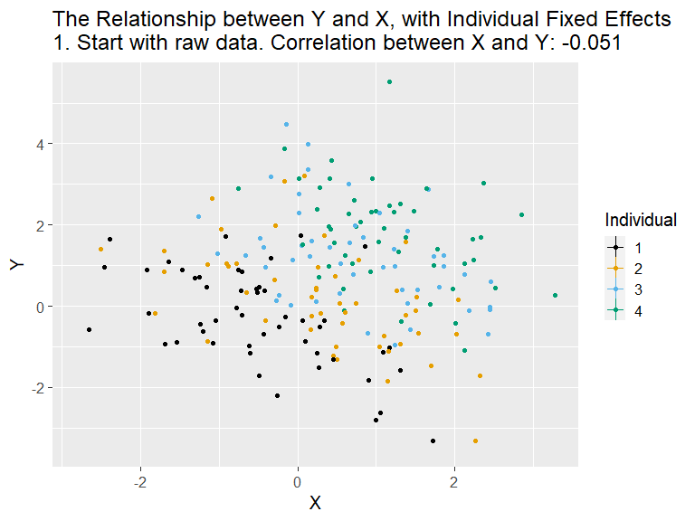
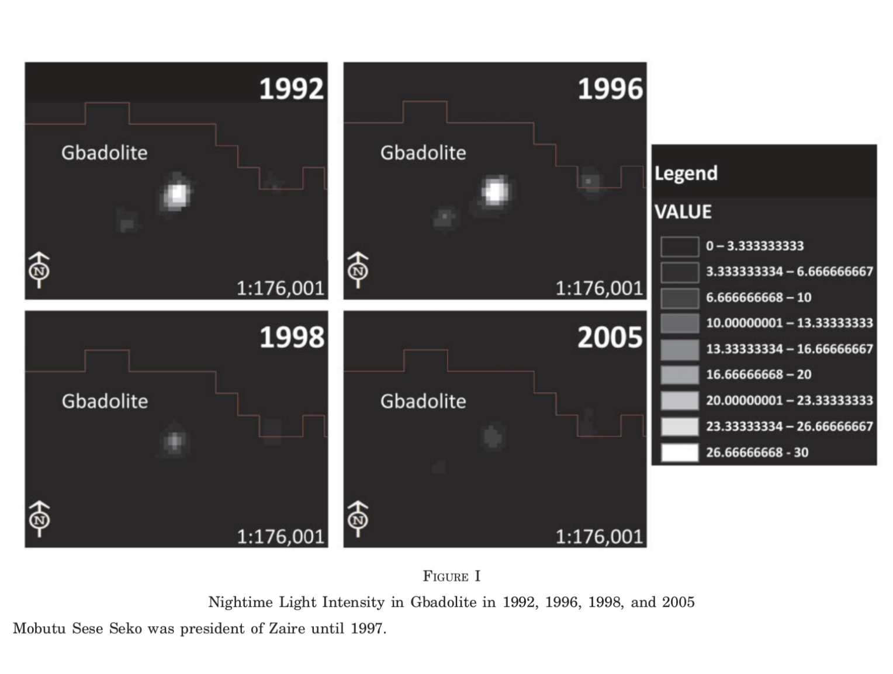
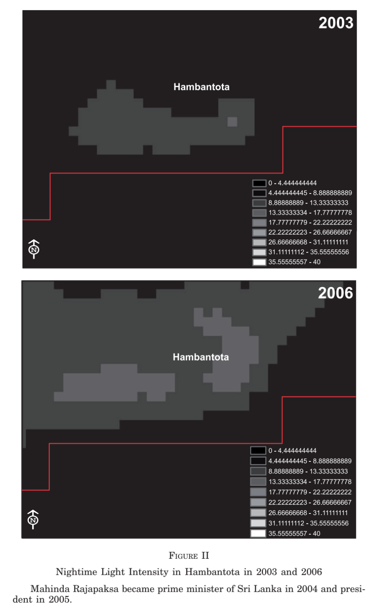
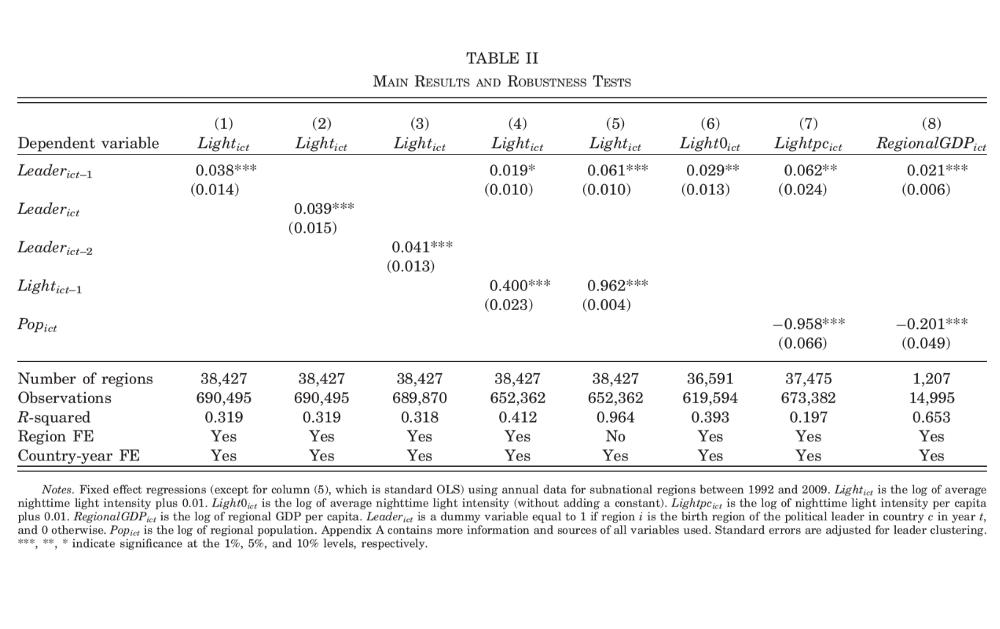

layout: true
background-image: url(images/ucab.png)
background-position: 100% 0%
background-size: 5%
---
class: inverse, center, middle

# Causalidad - Clase 7

## José Morales-Arilla y Carlos Daboín

#### Universidad Católica Andrés Bello 
#### Junio, 2022

```{r setup, echo = FALSE}
knitr::opts_chunk$set(fig.retina = 3, fig.width = 6, fig.asp = 0.618, out.width = "70%", fig.align = "center", warning = FALSE, message = FALSE)
library(tidyverse)
library(fixest)
library(haven)
```

---
# ¿Qué aprendimos la clase pasada? 

### Cerrar todas las posibles puertas traseras es demasiado difícil. Necesitamos variación exógena en $X$.

### A veces no tenemos un instrumento relevante y que cumpla con la restricción de exclusión.

### ¿Existe alguna discontinuidad en la asignación de $X$? Muchos contextos donde si.
- Puntajes mínimos para becas o acceso a programas.
- Puntaje de riesgo de salud mínimo para un tratamiento.
- Discontinuidades electorales, temporales, geográficas.

### En ese caso, dentro de una banda angosta, la discontinuidad separa la data en grupos comparables.
- Trade-off entre sesgo y varianza: Abrir un poco la banda y controlar por la "variable de asignación" a ambos lados.
- Robustez a distintas bandas, órdenes polinómicos de controles.
- Pruebas de balance en características base alrededor de la discontinuidad.
- Pruebas de manipulación: No debe haber cambio en la densidad de observaciones alrededor de la discontinuidad.

---
# De datos en seccion cruzada a datos de panel.

.pull-left[
### Hasta ahora hemos estado utilizando datos en seccion cruzada.
- Cada observación identifica a un individuo.
- Aprovechamos la asociación de variables entre distintos individuos.
- Ejemplo de una correlación: "Los países más ricos tienen mayor expectativa de vida".
]

--

.pull-right[
### En las próximas 3 clases usaremos datos de Panel
- Cada observación identifica a un individuo en un momento determinado.
- Aprovechamos la asociación de variables entre distintos individuos en distintos momentos.
- Ejemplo de una correlación: "En la medida en que los países se hacen más ricos, aumenta la expectativa de vida.
]

--

### Trabajar con datos de panel nos permite trabajar con los cambios en las variables:
- Crecimiento, caídas, apariciones, desapariciones.
- Porque los mismos "individuos" (países, personas, hogares, etc.) aparecen en distintos momentos.
- Esto nos puede ayudar a estructurar regresiones que cierran muchas puertas traseras.

---
# ¿ $Y$ $\to$ $EV$ ?

### Correlación en sección cruzada - todos los países en 2007: $EV_{c}=\beta_0 + \beta_1 Y_{c} + \epsilon_{c}$

.pull-left[
```{r corr1, fig.show = 'hide'}
# Vamos a usar data de salud e ingresos por país/año
# Fuente: Gapminder
library(gapminder)
data(gapminder) # Esto crea una base de datos
                # llamada Gapminder.
# Tengamos una data separada para Venezuela
Venezuela <- gapminder %>% filter(country == "Venezuela")

# Veamos la correlación entre 
# ingreso y expectativa de vida en 2007
gapminder %>% filter(year == 2007) %>%
  ggplot(., aes(x = log(gdpPercap), y = lifeExp)) +
  geom_point() + geom_smooth(method = 'lm') +
  geom_point(data = Venezuela[Venezuela$year == 2007,], 
             color = "red")
```
]

.pull-right[
### Parecieran asociarse positivamente en 2007.
```{r, ref.label="corr1", echo = FALSE}
```
]

--

### Nuestra regresión de mínimos cuadrados ordinarios.

---
# ¿ $Y$ $\to$ $EV$ ?

### Correlación en el panel - Todos los países, todos los años: $EV_{c,y}=\beta_0+\beta_1 Y_{c,y}+\epsilon_{c,y}$ 

.pull-left[
### Código
```{r corr2, fig.show = 'hide'}
# Veamos la correlación entre 
# ingreso y expectativa de vida
gapminder %>%
  ggplot(., aes(x = log(gdpPercap), y = lifeExp)) +
  geom_point() + geom_smooth(method = 'lm') +
  geom_point(data = Venezuela, 
             color = 'red')
```

]

.pull-right[
### Parecieran asociarse positivamente.
```{r, ref.label="corr2", echo = FALSE}
```
]

### Esto es lo que se conoce como los mínimos cuadrados ordinarios agrupados.

---
# ¿Que nos dice este resultado?

### ¿Qué teoría básica conecta ingresos y expectativa de vida? 

--

### ¿Este resultado es consistente con la teoría?

--

### ¿Este resultado es el efecto causal de los ingresos sobre la expectativa de vida?

--

### ¿Qué puertas traseras pueden existir entre ingresos y longevidad?

--

### Conflicto, geografía, pandemia, etc...

--

### Supongamos que solo nos preocupan esas tres. ¿Cuál sería el DAG?

---

# DAG: Conflicto, geografía y pandemias como puertas traseras.

```{r, echo = FALSE}
library(stats)
library(dagitty)
library(lavaan)

dag <- dagitty('dag {
    Y [pos="2,1"]
    C [pos="2.5,1.05"]
    G [pos="2.5,.95"]
    P [pos="2.5,.85"]
    EV [pos="3,1"]
    
    Y -> EV
    Y <- C -> EV
    Y <- G -> EV
    Y <- P -> EV
}')

plot(dag)
```

---
# ¿Qué podemos hacer?
### Supongamos que no observamos geografía y pandemia, pero observamos conflicto.

### Con los métodos que hemos utilizado hasta ahora, solo podríamos cerrar una puerta.

--

### Evaluemos la estructura de los datos: 
--

### - $Y$ y $EV$ toman valores distintos en el país y el tiempo.
--

### - $C$ toma valores distintos en el país y el tiempo.
--

### - $G$ no varía en el tiempo: La geografía solo varía entre países.
### - $P$ no varía entre países: Las pandemias afectan a todos los países al mismo tiempo.

---
# No podemos controlar por algo que no vemos...

### ...pero si sabemos que lo que no vemos es fijo para alguna dimensión de la data...

### ...controlar por esa dimensión cierra esa puerta trasera!

--

### Controlar por dimensiones de la data = Agregar **Efectos fijos**!

$$EV_{c,y} = \beta_0 + \beta_1 Y_{c,y} + \underbrace{\sum_{i=1}^{C}\gamma_i * 1[c = i]}_{\text{EF por países}} + \underbrace{\sum_{t=1}^{Y}\phi_t * 1[y = t]}_{\text{EF por años}} + \epsilon_{c,y}$$

--

### En esta regresión:
- ¿Qué puerta trasera cierran los efectos fijos por país? ¿Qué puerta trasera cierran los efectos fijos por año?
- ¿ $\beta_1$ captura el efecto causal del ingreso sobre la longevidad bajo nuestro DAG?

---
# ¿Por qué un efecto fijo cierra puertas traseras fijas?

### Supongamos que en el verdadero modelo solo la geografía es una puerta trasera.

### El modelo para estimar efecto de $Y$ sobre $EV$ sería...
$$EV_{c,y} = \beta_0 + \beta_1 Y_{c,y} + \beta_2 G_c + \epsilon_{c,y}$$

### En ambos lados de la igualdad, calculemos la media por país entre años:

$$\bar{EV}_c = \beta_0 + \beta_1 [\bar{Y}_c] + \beta_2 \bar{G}_c + \bar{\epsilon}_c$$

### Noten que $\bar{G}_c = G_c$. Ahora restemos las medias de la ecuación inicial:

$$EV_{c,y}-\bar{EV}_c = \underbrace{[\beta_0 - \beta_0]}_{0}+ \beta_1 [Y_{c,y}-\bar{Y}_c] + \beta_2 \underbrace{[G_c-G_c]}_{0} + [\epsilon_{c,y}-\bar{\epsilon}_c]$$

---
# "Efectos fijos" por país = Quitar media por país de $Y$ y $EV$.

.center[

]

### Filtrar variación entre países antes de estimar $\beta_1$. Usas variación "a lo interno" de los países (años). 

---
# De vuelta a los datos: Agreguemos efectos fijos por país.
.pull-left[
```{r EFc, fig.show = 'hide'}
# Calculemos medias de Y y EV:
gapminder <- gapminder %>%
  group_by(country) %>%
  mutate(log_gdppc = log(gdpPercap),
         log_gdppc_demean_c = log_gdppc - mean(log_gdppc),
         lifeExp_demean_c = lifeExp - mean(lifeExp)) %>%
  ungroup()

# Visualicemos variables estandarizadas
gapminder %>% 
  ggplot(., aes(x = log_gdppc, 
                     y = lifeExp)) +
  geom_point() + geom_smooth(method = 'lm') +
  geom_point(aes(x = log_gdppc_demean_c, 
                 y = lifeExp_demean_c), 
             color = "red") + 
  geom_smooth(aes(x = log_gdppc_demean_c, 
                 y = lifeExp_demean_c),
              method = 'lm')
```
]

.pull-right[

### $\beta_1$ no cambia mucho por agregar EF por país.
```{r, ref.label="EFc", echo = FALSE}
```
]

---
# Ahora veámoslo con efectos fijos por año.
.pull-left[
```{r EFy, fig.show = 'hide'}
# Calculemos medias de Y y EV:
gapminder <- gapminder %>%
  group_by(year) %>%
  mutate(log_gdppc_demean_y = log_gdppc - mean(log_gdppc),
         lifeExp_demean_y = lifeExp - mean(lifeExp),) %>%
  ungroup()

# Visualicemos variables estandarizadas
gapminder %>% 
  ggplot(., aes(x = log_gdppc, 
                     y = lifeExp)) +
  geom_point() + geom_smooth(method = 'lm') +
  geom_point(aes(x = log_gdppc_demean_y, 
                 y = lifeExp_demean_y), 
             color = "red") + 
  geom_smooth(aes(x = log_gdppc_demean_y, 
                 y = lifeExp_demean_y),
              method = 'lm')
```
]

.pull-right[

### $\beta_1$ no cambia mucho por agregar EF por año.
```{r, ref.label="EFy", echo = FALSE}
```
]

---
# Ahora veámoslo con ambos efectos fijos.
.pull-left[
```{r EFcy, fig.show = 'hide'}
# Calculemos medias de Y y EV:
gapminder <- gapminder %>%
  group_by(year) %>%
  mutate(log_gdppc_demean_cy = log_gdppc_demean_c - mean(log_gdppc),
         lifeExp_demean_cy = lifeExp_demean_c - mean(lifeExp)) %>%
  ungroup()

# Visualicemos variables estandarizadas
gapminder %>% 
  ggplot(., aes(x = log_gdppc, 
                     y = lifeExp)) +
  geom_point() + geom_smooth(method = 'lm') +
  geom_point(aes(x = log_gdppc_demean_cy, 
                 y = lifeExp_demean_cy), 
             color = "red") + 
  geom_smooth(aes(x = log_gdppc_demean_cy, 
                 y = lifeExp_demean_cy),
              method = 'lm')
```
]

.pull-right[

### $\beta_1$ pareciera cambiar al agregar ambos.
```{r, ref.label="EFcy", echo = FALSE}
```
]

---
# Veámoslo en regresión
.pull-left[
```{r}
library(fixest)
library(modelsummary)
# Minimos Cuadrados Agrupados
m1 <- feols(lifeExp ~ log_gdppc, 
            data = gapminder)
# Efectos fijos por pais
m2 <- feols(lifeExp ~ log_gdppc | country, 
            data = gapminder)
# Efectos fijos por año
m3 <- feols(lifeExp ~ log_gdppc | year, 
            data = gapminder)
# Ambos efectos fijos
m4 <- feols(lifeExp ~ log_gdppc | country + year, 
            data = gapminder)


table <- msummary(list('MCOAg' = m1, 'FE pais' = m2,
              'FE año' = m3, 'FE ambos' = m4), 
         data = gapminder, stars = TRUE, 
         gof_omit = 'AIC|BIC|F|Lik|Adj|Pseudo')
```
]

.pull-right[
```{r, echo = FALSE}
table
```
]
---
# ¿Podemos interpretar este $\beta_1$ como el verdadero efecto causal?

### Bajo el modelo detrás de nuestro DAG, no!
- Aún tendríamos que controlar por Conflicto.

### ¿Por qué los efectos fijos por país y año no controlan por conflicto?
--

- Para un país dado (EEUU), algunos años está en guerra, en otros años no.
- Para un año dado (2007), hay algunos países en guerra y otros no.

--

### El conflicto cambia a lo interno de los países y los años... al igual que el ingreso y la longevidad.
- Cerraste todas las puertas traseras que no varían al nivel país/año. 
- Con EF, nada que que varíe en dimensiones más agregadas que causa y consecuencia va a generar sesgos.
- Aún pueden haber puertas traseras al nivel de variación relevante.
  - Si son observables, simplemente controla por ellas.
  - Si no son observables, entonces no puedes concluir que $\beta_1$ es el efecto causal.
  
---
# EF: Lo que no resuelve, para que no sirve, y que no representa.

### Lo que no resuelve: Puertas traseras que varían en la dimensión de causa y efecto.
- En el ejemplo previo, no cierra la puerta trasera del conflicto.

### Para lo que no sirve: Para estimar efectos causales entre variables fijas.
- ¿Cuál es el efecto de la Latitud sobre la longevidad? No puedes incorporar efectos fijos.

### Lo qué no representa: Observaciones sin variación "a lo interno" de las categorías controladas.
- ¿Cuál es el efecto de la democracia sobre la longevidad? Puedes poner efectos fijos, pero resultados no serán representativos de países que siempre fueron democracia o siempre fueron dictadura.

---
# Favoritismo regional (Hodler y Raschky, 2014)

### Para una región, ¿Cuál es el efecto económico de tener una afiliación política con líder de turno?

### ¿Qué razones o teorías podrían predecir un efecto positivo? ¿Cuáles podrían predecir un efecto negativo?

--

.pull-left[

]

.pull-right[

]

---
# Favoritismo regional (Hodler y Raschky, 2014)

### Medidas de la causa y la consecuencia de interés:
- $L_{r,y}$: Binaria, si la región $r$ es el lugar de nacimiento del lider del país $c$ en el año $y$. 
- $Y_{r,y}$: Log de emisión de luces nocturnas de la región $r$ en el año $y$.

### ¿Por qué una correlación simple puede estar sesgada?
--

- Líderes pueden venir de zonas más ricas, culturalmente dominantes, centrales. 
- Las zonas de origen de los líderes pueden ser más resilientes a shocks nacionales.

--

### ¿Qué regresión corren?

$$Y_{r,y} = \gamma L_{r,y-1} + FE_r + FE_{c,y} + \epsilon_{r,y}$$

- Efectos fijos por región y por país año. Amenazas tienen que variar a nivel región-año.

---
# Favoritismo regional (Hodler y Raschky, 2014)
.center[

]

---
class: center, middle

# Gracias