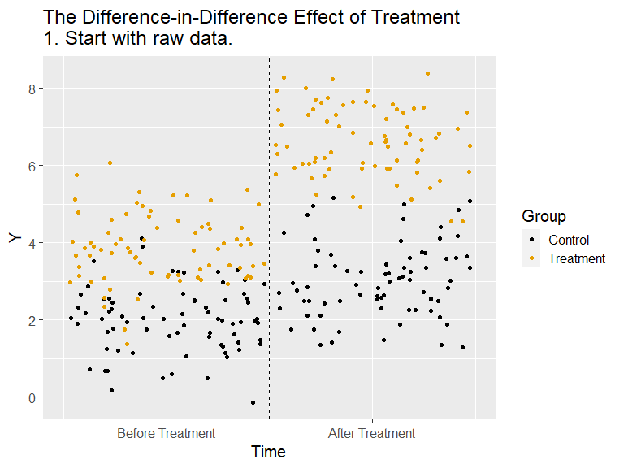
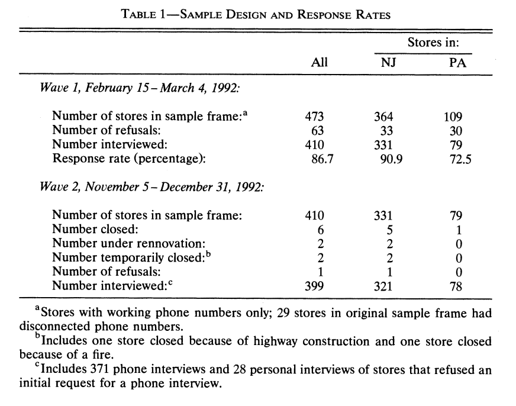
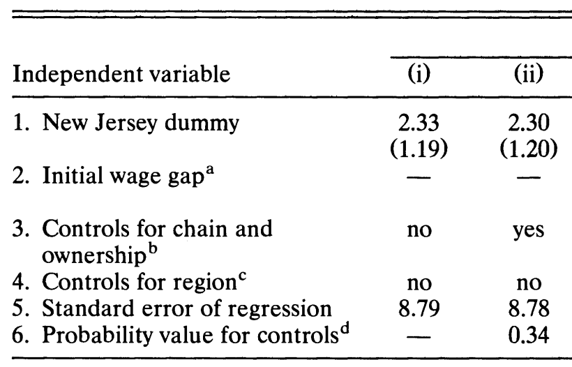

layout: true
background-image: url(images/ucab.png)
background-position: 100% 0%
background-size: 5%
---
class: inverse, center, middle
# Causalidad - Clase 8

## José Morales-Arilla y Carlos Daboín

#### Universidad Católica Andrés Bello 
#### Junio, 2022

```{r setup, echo = FALSE}
knitr::opts_chunk$set(fig.retina = 3, fig.width = 6, fig.asp = 0.618, out.width = "70%", fig.align = "center", warning = FALSE, message = FALSE)
library(tidyverse)
library(fixest)
library(haven)
library(stats)
library(dagitty)
library(lavaan)
```

---
# ¿Qué aprendimos la clase pasada? 

### Podemos aprovechar la estructura de la base de datos para cerrar puertas traseras.

### Datos en formato de panel: Individuos en distintos momentos del tiempo.

### ¿Nos preocupan puertas traseras fijas en el tiempo para todos los individuos? Efecto fijo por individuos.

### ¿Nos preocupan puertas traseras fijas entre individuos para período? Efecto fijo por período.

### Efectos fijos:
- Filtran variación "entre" niveles de la data de la variación "a lo interno" de los niveles.
- Supuesto de identificación: Independencia condicional en la variación "a lo interno".
- Amenazas a la identificación tienen que variar "a lo interno" de los efectos fijos.
---
# Sesgo de selección en sección cruzada: $T$ $\not \perp$ $Y^x$.

.pull-left[
### Contexto:
- Nos interesa el efecto del tratamiento binario $T$...
- ...sobre el resultado $Y$.
- Muchos individuos en un momento del tiempo.

### Problema:
- Asignación del tratamiento $T$ puede no ser independiente de los resultados potenciales de $Y$.
- Es decir, $T$ puede correlacionarse con otras características de los individuos que también determinan a $Y$. 
- Ejemplo: Educación, ingresos y "Habilidad".

]

.pull-right[
### Visualizando el DAG:
```{r, echo = FALSE}
dag <- dagitty('dag {
    T [pos="1,1"]
    i [pos="2,2"]
    Y [pos="3,1"]
    
    T -> Y
    T <- i -> Y
    
}')

plot(dag)
```

### Resultado: 
- $E[Y_i|T_i=1]-E[Y_i|T_i=0]\not = ATE$

]
---
# Sesgo de selección en serie de tiempo: $T$ $\not \perp$ $Y^x$.

.pull-left[
### Contexto:
- Nos interesa el efecto del tratamiento binario $T$...
- ...sobre el resultado $Y$.
- Muchos períodos, un solo individuo.

### Problema:
- Asignación del tratamiento $T$ puede no ser independiente de los resultados potenciales de $Y$.
- Es decir, $T$ puede correlacionarse con otras características de los individuos que también determinan a $Y$. 
- Ejemplo: Tendencias, otros shocks distintos al tratamiento, etc.

]

.pull-right[
### Visualizando el DAG:
```{r, echo = FALSE}
dag <- dagitty('dag {
    T [pos="1,1"]
    t [pos="2,2"]
    Y [pos="3,1"]
    
    T -> Y
    T <- t -> Y
}')

plot(dag)
```

### Resultado: 
- $E[Y_t|T_t=1]-E[Y_t|T_t=0]\not = ATE$
]

---
# Sesgo de selección en datos de panel:

.pull-left[
### Contexto:
- Nos interesa el efecto del tratamiento binario $T$...
- ...sobre el resultado $Y$.
- Muchos períodos, muchos individuos.

### Problema:
- $T$ $\not \perp$ $Y^x$ entre individuos.
- $T$ $\not \perp$ $Y^x$ en el tiempo.

### Supuesto de "Tendencias paralelas":
- Tiempo afecta a todos los individios por igual.


]
.pull-right[
### Visualizando el DAG:
```{r, echo = FALSE}
dag <- dagitty('dag {
    T [pos="1,1"]
    t [pos="2,2"]
    i [pos="2,0"]
    Y [pos="3,1"]
    
    T -> Y
    T <- t -> Y
    T <- i -> Y
}')

plot(dag)
```

### Resultado:
- $\Delta_{pre}^{post} \{ E[Y_t|T_t=1]-E[Y_t|T_t=0]\} = ATE$
]

---
class: center, middle
# Ejercicio de simulación

---
# ¿Por qué se llama "diferencia en diferencias" (diff-in-diff o DiD)?

### En sección cruzada: Diferencia entre grupo tratado y grupo de control.

### En serie de tiempo: Diferencia entre período pre-tratamiento y post-tratamiento.

### En panel: Cambio en la diferencia entre grupo tratado y grupo de control... 
### ...entre el período pre-tratamiento y el período post-tratamiento.

# ¿Por qué funciona?
- Asignación del tratamiento entre individuos no es aleatoria, pero su efecto solo opera después del tratamiento.
- Grupo de control no es un buen "contrafactual" para el nivel de la consecuencia $Y$ en el grupo tratado.
- Pero si todos los factores que inducen **cambios** en $Y$ en el tiempo afectan a ambos grupos por igual...
- ...entonces el grupo de control si es un buen "contrafactual" para los **cambios** en $Y$ en el grupo tratado. 
- En ese caso, **diferencia** en el tiempo de la **diferencia** entre grupo de control y grupo de tratamiento = ATE.

---
# Visualmente...

.center[

]
---
# DiD fundacional: Salario mínimo
### Pregunta: ¿Cuál es el efecto del salario mínimo sobre el empleo?
--

### Hipótesis teórica base: 
--

### - $\uparrow$ Salario mínimo $\to$ $\downarrow$ Demanda de empleo $\to$ $\uparrow$ Desempleo
--

### ¿Correlación entre presencia de salario mínimo y empleo = ATE?
--

### - No, porque problemas de desempleo pueden afectar políticas salariales locales (causalidad inversa).

---
# Card and Krueger (1994)

### - New Jersey aumentó el salario mínimo de $4.25 a $5.05 el 1 de abril de 1992.

### - En Pennsylvania no hubo subida del salario mínimo.
--

.pull-left[
### Data: 
### - 410 restaurantes de comida rápida...
### - ...en New Jersey y Pennsylvania... 
### - ...justo antes de la subida...
### - ...y 9 meses después de la subida.
]
.pull-right[
.center[

]
]
---
# Card and Krueger (1994)

### $$E_{i,t}=\beta_0 + \beta_1 NJ_{i} + \beta_2 Post_{t} + \beta_3 NJ_i * Post_t + \epsilon_{i,t}$$

.pull-left[
#### $\beta_0=\bar{E}_{Penn}^{Pre}$
#### $\beta_1=\bar{E}_{NJ}^{Pre}-\bar{E}_{Penn}^{Pre}$
#### $\beta_2=\bar{E}_{Penn}^{Post}-\bar{E}_{Penn}^{Pre}$
#### $\beta_3 = \Delta_{Pre}^{Post}\{\bar{E}_{NJ}^{t}-\bar{E}_{Penn}^{t}\} = \Delta_{Penn}^{NJ}\{\bar{E}_{i}^{Post}-\bar{E}_{i}^{Pre}\}$

]

.pull-right[
.center[

]
]
--

### C&K94: Aumento de salario mínimo no redujo (¿aumentó?) empleo en Nueva Jersey.

---
# Supuesto fundamental de "tendencias paralelas"
```{r, echo = FALSE}
dag <- dagitty('dag {
    T [pos="1,1"]
    t [pos="2,2"]
    i [pos="2,0"]
    Y [pos="3,1"]
    
    T -> Y
    T <- t -> Y
    T <- i -> Y
}')

plot(dag)
```
---
# Supuesto fundamental de "tendencias paralelas":

### Supuesto de identificación:
- Los cambios en el grupo de control son un contrafactual de los cambios del grupo de tratamiento si no hubiera existido el tratamiento. 
- Esto sería el caso si los efectos del tiempo sobre la consecuencia de interés afectan a unidades tratadas y no tratadas de igual forma.
- El supuesto implica que, de no haber existido tratamiento, la diferencia promedio entre unidades tratadas y no tratadas se mantendría igual a la observada previo al tratamiento.

### El supuesto de tendencias paralelas no se puede testear, pero se puede evaluar su plausibilidad. Si la tendencia en el resultado entre el grupo tratado y no tratado era paralela previo al tratamiento, entonces el supuesto de que se habrían mantenido paralelas en ausencia de tratamiento es plausible.
--

### En Card y Krueger (1994) no se puede evaluar, porque hay un solo período pre-tratamiento. 

- Para testear tendencias paralelas pre-tratamiento se necesita data de 3 períodos previo al tratamiento.

---
# Testear plausibilidad de tendencias paralelas pre-tratamiento:

### Vía #1: Quedarte con data del pre-tratamiento y testear el efecto de la interacción entre el período y $T$.
- Si el efecto es significativo, eso significa que la diferencia entre tratamiento y control cambia con el tiempo antes del tratamiento. Evidencia en contra de "tendencias paralelas".

### Vía #2: Quedarte con data del pre-tratamiento, crea un post-tratamiento placebo y testea el DiD.
- Si el efecto es significativo, eso significa que la diferencia entre tratamiento y control ya venía ocurriendo antes del tratamiento.

### Vía #3: Quedarte con toda la data y evaluar los efectos dinámicos:
- Correr mismo DiD pero sustituir interacción del tratamiento con "post" por interacciones del tratamiento con dummies para cada período, excluyendo el último período antes del tratamiento.

---
# Caso de estudio: The Earned Income Tax Credit.

.pull-left[
### EITC: Subsidio fiscal para madres.

### Proporcional a ingresos laborales. 

### Fue aumentado en 1993.

### Debería aumentar incentivos al trabajo... 
- ... Solo para las madres...
- ... Solo a partir de 1994.
]

--

.pull-right[
### ¿Qué vamos a hacer?

### - Abrir y evaluar la data
### - Identificar tratamiento y post-tratamiento
### - Visualizaciones descriptivas clave
### - Obtener estimación vía DiD
### - Tendencias paralelas + Efectos dinámicos
]
---
class: middle center

# Caso de estudio: The Earned Income Tax Credit

---
# Hasta ahora hemos visto...

### Tratamientos binarios
- Si el tratamiento es continuo, el DiD lo que captura es el cambio del coeficiente del tratamiento entre antes y después del tratamiento.
- La lógica con tratamientos continuos aplica sin inconvenientes.

### Todas las unidades tratadas son tratadas en el mismo momento
- Suponte que te interesa el efecto de los impuestos a los cigarrillos sobre el consumo.
- Problema: Distintos estados implementan impuestos en distintos momentos. 
- Se puede ejecutar el mismo TWFE que hemos venido discutiendo hasta ahora...
- Pero en presencia de efectos heterogeneos/dinámicos, literatura econométrica reciente sugiere que TWFE produce resultados sesgados. 
- Tarea 3: Van a ejecutar un método que corrige por estas preocupaciones. 

### Literatura econométrica sobre DiD está muy activa! DiD es el método cuasi-experimental más popular!
---

class: center, middle

# Gracias