layout: true
background-image: url(images/ucab.png)
background-position: 100% 0%
background-size: 5%
---
class: inverse, center, middle
# Causalidad - Clase 9

## José Morales-Arilla y Carlos Daboín

#### Universidad Católica Andrés Bello 
#### Junio, 2022

```{r setup, echo = FALSE}
knitr::opts_chunk$set(fig.retina = 3, fig.width = 6, fig.asp = 0.618, out.width = "70%", fig.align = "center", warning = FALSE, message = FALSE)
library(tidyverse)
library(fixest)
library(haven)
library(stats)
library(dagitty)
library(lavaan)
```

---
# ¿Qué aprendimos la clase pasada? 

### En datos de panel, pueden existir puertas traseras a nivel de los individuos o a nivel del tiempo.

#### - Asignación no es aleatoria entre individuos, tendencias en el tiempo, etc...
#### - Diferencia en resultado promedio entre individuos/períodos tratados y no tratados $\not =$ ATE.

### Bajo el supuesto de "Tendencias paralelas", el cambio en las diferencias entre unidades tratadas...
### ... y no tratadas entre antes y después del tratamiento = ATE: "Diferencia en diferencias".
#### - "Tendencias paralelas": El tiempo afecta a todas los individuos de la misma forma.
#### - Los resultados de las unidades tratadas habrían cambiado como las unidades de control en ausencia del tratamiento.
### Tendencias paralelas no se pueden testear... post-tratamiento. ¿Plausible? Checkea pre-tratamiento.

---
# Otro paper fundacional de DiD: Los Marielitos en Miami.

### Pregunta: ¿Cuál es el efecto de la migración sobre los resultados laborales de los locales?

### Expectativa de un modelito básico:
--

### - $\uparrow$ Oferta de trabajo $\to$ $\downarrow$ Salarios; $\uparrow$ Desempleo.
--

### Card (1990): ¿Qué le pasó al empleo de los locales en Miami después de la llegada de los Marielitos?
- 1980: Fidel Castro permite que quien quiera irse de Cuba se vaya. EEUU con política "pies secos, pies mojados".
- Entre abril y octubre de 1980, 125,000 Cubanos se fueron a EEUU, principalmente a Miami.
- Aumento de 7% de la fuerza laboral en Miami, fundamentalmente de bajas capacidades, en un area pequeña.

--

### Las personas que vivían en Miami son los tratados, pero... ¿Quién es el grupo de control?
- Card eligió 5 ciudades: Atlanta, Los Angeles, Houston y Tampa. "Parecidas económica y demográficamente".

---
# DiD: ¿Empleo/salarios relativos de Miami empeoraron post 1980?

.center[
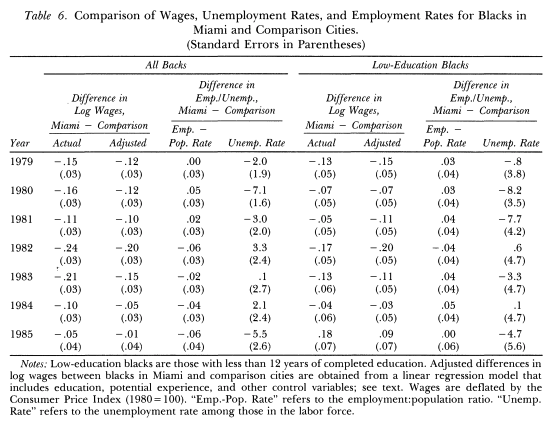
]

---
# Conclusión de Card: Marielitos no tuvieron un efecto negativo.

### Resultado super controversial: 
- ¿Un shock así de masivo en la oferta laboral no genera desempleo/caída salarial? Modelos están equivocados!
- Modelos alternativos: Mercados laborales locales monopsonistas (similar al salario mínimo).

### Enorme debate metodológico sobre si el análisis de Card fue correcto.
- Muchos factores. Se ve en distintos contextos donde se estudia preguntas similares (Colombia y Venezolanos).

--

### Desde la perspectiva del curso, ¿Cuál creen ustedes que fue la crítica principal a Card (1990)?

--

### Crítica principal: ¿Por qué seleccionar esas ciudades como grupo de control, y no otras?
- Card (1990) lo discute en un pie de página, pero en el fondo fue una decisión arbitraria.

---
# Casos de estudio comparativos (una sola unidad tratada)

### Toqueville y la "Democracia en América": EEUU como caso de estudio en democracia.
- Su conclusión: Si la gente en Francia se comportara como en EEUU, Francia podría aspirar a una democracia.

### Problemas clave de este tipo de "análisis comparativo" (Típico en las ciencias políticas):
- Solo dos observaciones: El resultado de que hay más democracia con el comportamiento de los americanos puede ser por que son solo dos observaciones (¿Qué tan salada está la sopa?).
- ¿Por qué esas dos observaciones, y no otras? Subjetividad, posible que el resultado se deba a "cherry picking". 

### ¿Cómo escoger referencias para análisis compartivos en casos de estudio?
- Objetivos: Expandir el número de referencias + seleccionar referencias de forma objetiva y replicable.

### Solución: Método de controles sintéticos!

---
# Controles sintéticos - Abadie et al (2003, 2010):

### Método basado en datos para elegir el grupo de referencia de forma objetiva y replicable.

### ¿Cómo opera el método?
### 1. Panel de individuos en el tiempo. Solo uno es tratado.
### 2. Conseguir el promedio de los no tratados que mejor aproxima a al tratado antes del tratamiento.
### 3. Comparar el comportamiento del tratado y con su control sintético después del tratamiento.
### 4. Mostrar que replicar el ejercicio con individuos "placebo" no genera los mismos resultados.

--

### Peri y Yasenov (2018): Card (1990) con control sintético, consiguen lo mismo.

---
# Abadie y Gardeazabal (2003):

### Pregunta: ¿Cuáles son los efectos económicos del terrorismo?

--

### Contexto: Terrorismo de ETA.
- ETA: Grupo terrorista en favor de la independencia del País Basco.
- Período de mayor actividad: Finales de los 60s - finales de los 90s.
- Tregua en 1999, Cese de actividades en 2011. Vean "Patria" en HBO.

--

### ¿Por qué no podemos simplemente ver que le pasó al PIB del País Basco a partir de 1970?

--

- España creció mucho alrededor de la transición a la democracia (1975).

--

### ¿Por qué no comparar al País Basco con un promedio del resto de España?

--

- País Basco venía en tendencia muy distinta al resto del país.

---
# Abadie y Gardeazabal (2003):

### Estrategia: Construir un promedio ponderado de otras provincias españolas no afectadas por ETA.
- Criterio: Minimizar la diferencia entre el PIB basco y el del promedio antes del inicio del conflicto contra ETA.

### Control sintético resultante: 85% Cataluña, 15% Madrid, 0% para todas las demás.
- Para nada sorprendente: PIB y población de estas regiones venía creciendo de forma similar al País Basco.

### Validación placebo: No debería haber un efecto del terrorismo entre Cataluña y su versión "sintética".
- Repetir el ejercicio para Cataluña y mostrar que no hay un resultado.

### Conclusión: El terrorismo de ETA redujo el PIB per capita del País Basco en 10pp vs. control sintético. 
---
# Abadie y Gardeazabal (2003):
### El País Basco sintético se parece más al País Basco antes de ETA que el promedio de España.
.center[
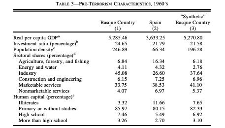
]
---
# Abadie y Gardeazabal (2003):

.pull-left[
### País Basco vs. País Basco Sintético
.center[
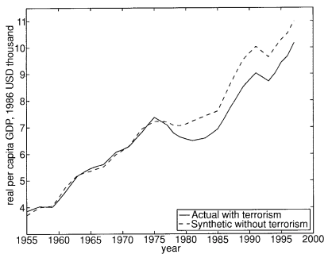
]
]

.pull-right[
### Cataluña vs. Cataluña sintética
.center[
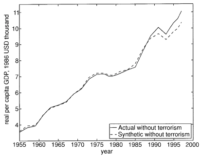
]
]
---
# Abadie, Diamond y Hainmueller (2015)

### Pregunta: ¿Cuál fue el efecto económico de la reunificación alemana sobre Alemania Occidental?

- ¿Por qué podría ser buena la reunificación en lo económico? ¿Por qué podría ser mala?

--

### ¿Por qué no podemos simplemente ver el cambio en el PIB per capita de Alemania Occidental?

--

- Mayor crecimiento de la economía mundial en los 90s. 

--

### ¿Por qué no podemos comparar contra el promedio de los países OECD?

--

- Muchos países estaban "convergiendo" a los niveles de ingreso de Alemania Occidental (España, Italia, Portugal...)

--

### Solución: Construir la Alemania Occidental Sintética!

- 42% Austria, 16% Japón, 9% Holanda, 11% Suiza, 22% EEUU.

---
# Abadie, Diamond y Hainmueller (2015)

.pull-left[
### Alemania Occidental vs. Versión Sintética
.center[
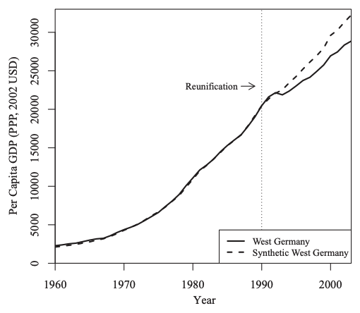
]
]

.pull-right[
### Diferencias antes y después de la unificación
.center[
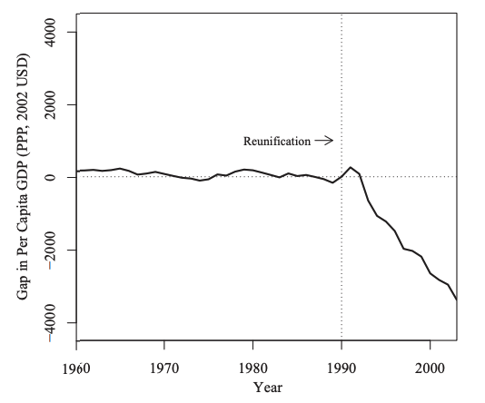
]
]

---
# Abadie, Diamond y Hainmueller (2015)

.pull-left[
### Unificación Placebo en 1975 en lugar de 1990 
.center[
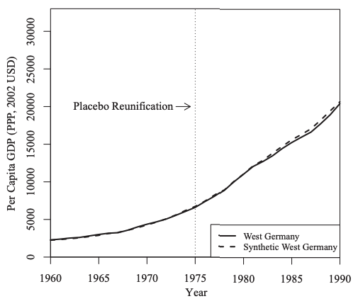
]
]

.pull-right[
### CS para placebos predicen bien post-unificación
.center[
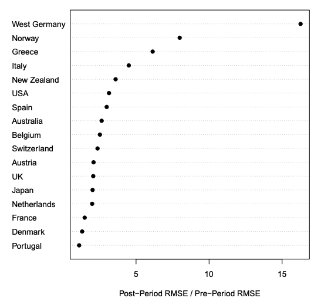
]
]

---
# Abadie, Diamond y Hainmueller (2010)

### Pregunta: ¿Cuál es el efecto de políticas para el control del consumo de tabaco?

- ¿Por qué podría ser negativo? Porque funcionan. ¿Por qué podría ser positivo? "No pienses en un elefante!".

### Contexto: Proposición 99 en California, aprobada en 1988:
- Impuesto al cigarrillo de 25 centavos por cajetilla. 
- Etiquetaba ingresos al presupuesto de campañas anti-tabaco. 
- Políticas de aire limpio puertas adentro en todo el estado. 

### ¿Por qué no ver simplemente que pasó con el consumo en California? ¿Por qué no comparar contra EEUU?
- Consumo ya venía cayendo en California... pero no en todos los EEUU.

### California Sintética: 31% Colorado, 24% Nevada, 37% Utah, 8% Connecticut. 

---
# Abadie, Diamond y Hainmueller (2010)

.center[
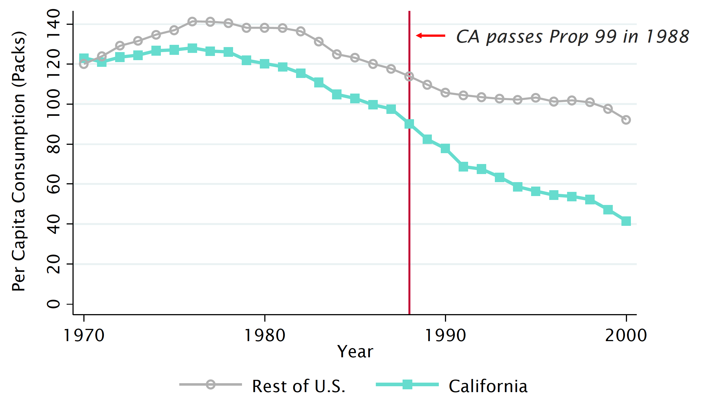
]

---
# Abadie, Diamond y Hainmueller (2010)

.center[
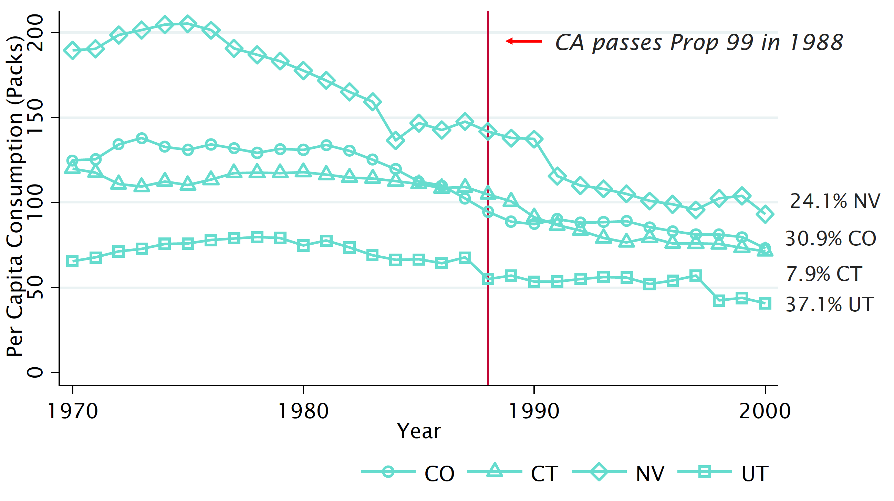
]
---
# Abadie, Diamond y Hainmueller (2010)

.center[
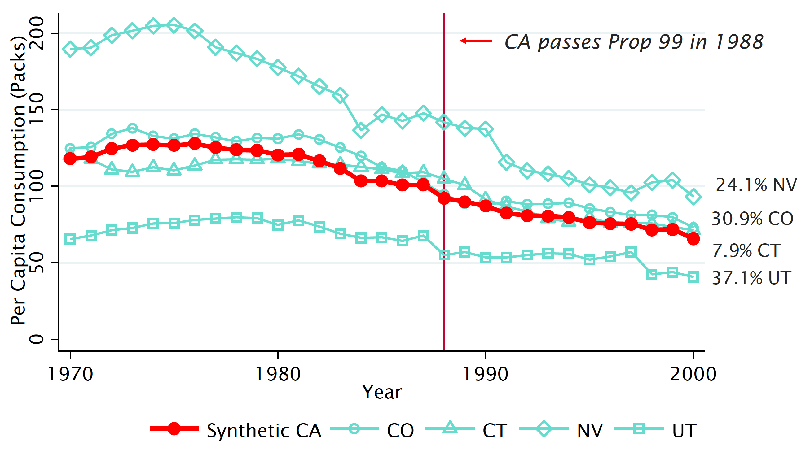
]

---
# Abadie, Diamond y Hainmueller (2010)

.center[
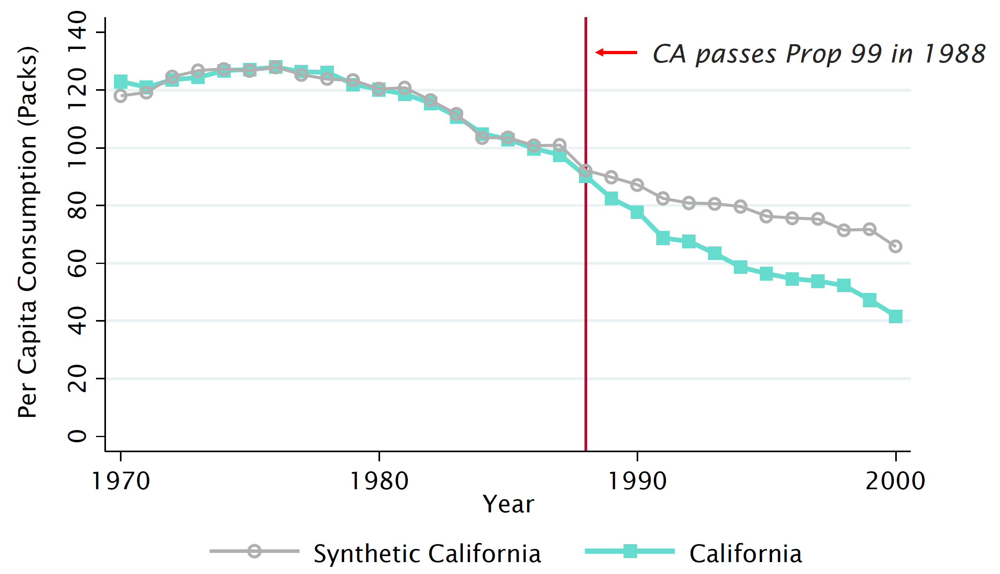
]
---
# Abadie, Diamond y Hainmueller (2010)

.center[
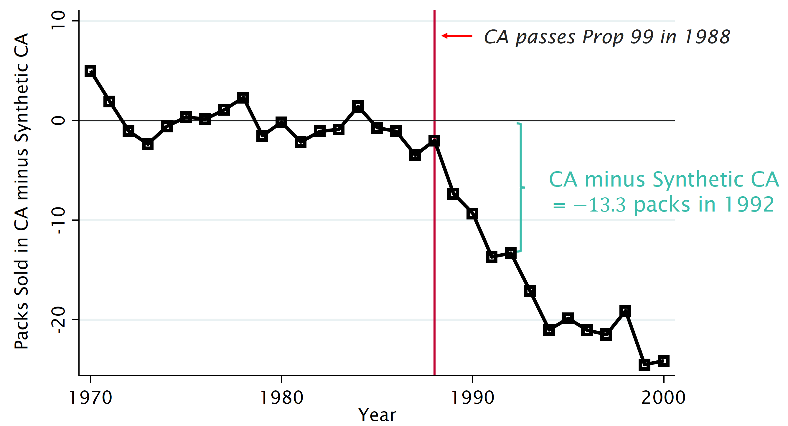
]
---
# Abadie, Diamond y Hainmueller (2010)

.center[
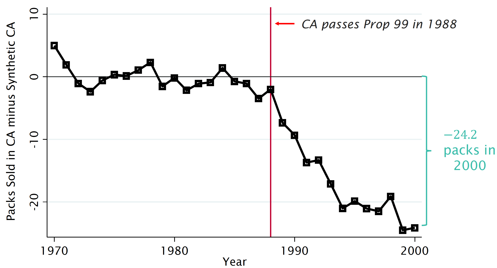
]
---
# Abadie, Diamond y Hainmueller (2010)

.center[
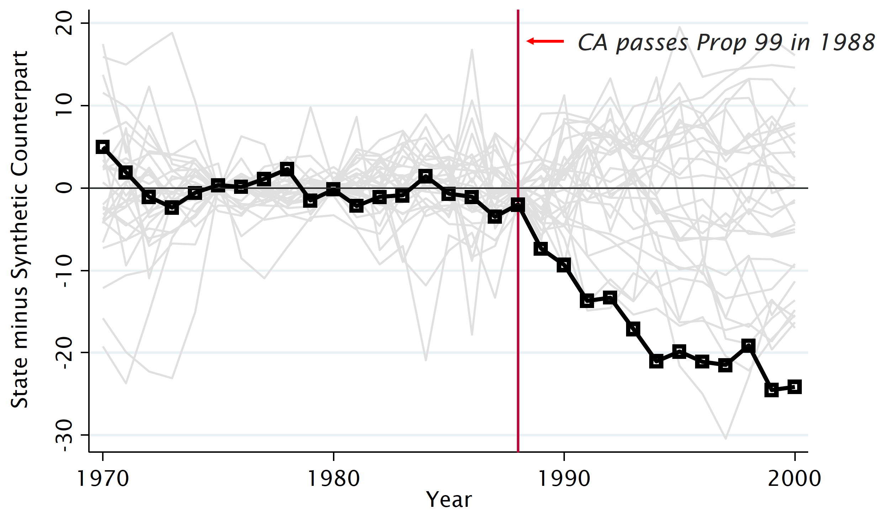
]
---
# Abadie, Diamond y Hainmueller (2010)

.center[
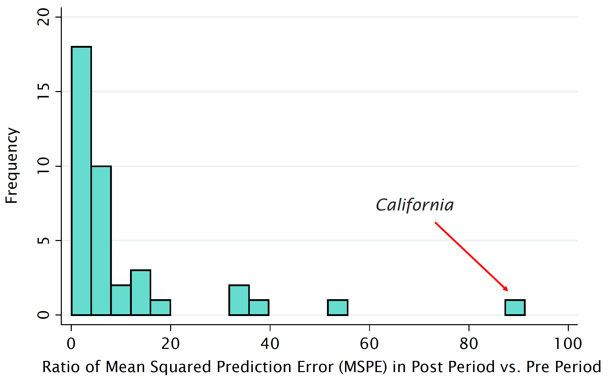
]

---
class: center, middle
# Replicando Abadie, Diamond y Hainmueller (2010)

---
# Factores a tener en cuenta:
### ¿Qué variables entran en la predicción pre-tratamiento?
- Margen para la manipulación. Cosas distintas al valor rezagado de la variable resultado deben justificarse.

### ¿Qué unidades entran en el "pool de donantes" para el control sintético?
- Unidades que no hayan tenido tratamientos similares en el período de análisis.
- Eg: ¿Otra provincia víctima del terrorismo? ¿Otro país reunificado? ¿Otro estado con políticas anti-tabaco?
- ¿Por qué no? Porque queremos estimar el "contrafactual" de lo que habría pasado a la unidad tratada en ausencia de tratamiento.

### ¿Qué tipo de tratamiento podemos analizar?
- Aquellos que ocurren de forma aislada en la unidad de tratamiento. - Tratamientos múltiples previenen estimar efectos independientes.
- Producción petrolera anual de Vzla a partir de 2017: ¿Sanciones, Constituyente o control militar de PDVSA?

---
class: center, middle

# Gracias